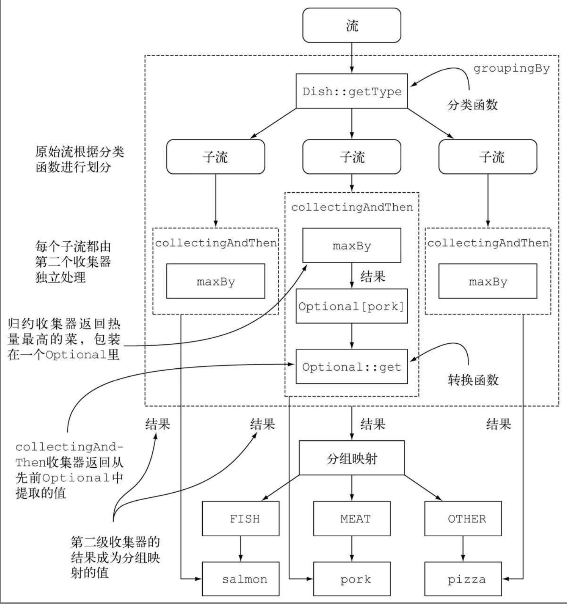

# Lambda分组详解

可以使用`Collectors.groupingBy`的工厂方法来实现，下面是最简单的分类方法：

```java
        Map<Dish.Type, List<Dish>> dishesByType=
                                menu.stream().collect(groupingBy(Dish::getType));
```

如果你想按照食物的高热量和低热量来进行分组呢？

```java
        public enum CaloricLevel { DIET, NORMAL, FAT }

        Map<CaloricLevel, List<Dish>> dishesByCaloricLevel=menu.stream().collect(
                groupingBy(dish-> {
                        if (dish.getCalories() <=400) return CaloricLevel.DIET;
                        else if (dish.getCalories() <=700) return
            CaloricLevel.NORMAL;
                else return CaloricLevel.FAT;
                  } ));
```

## 二级分类

```java
List<Dish> dishList=new ArrayList<>();

        Map<Dish.Type, Map<String, List<Dish>>> collect = dishList.stream().collect(groupingBy(Dish::getType, groupingBy(dish -> {
            if (dish.getCalories() <= 400) {
                return "diet";
            } else if (dish.getCalories() <= 700) {
                return "normal";
            } else {
                return "fat";
            }
        })));
```

需要注意的是编写的代码是在groupingBy函数里面；

根据源码来看，接受的是一个Collector接口。所以还可以进行拓展。

```java
public static <T, K, A, D>
    Collector<T, ?, Map<K, D>> groupingBy(Function<? super T, ? extends K> classifier,
                                          Collector<? super T, A, D> downstream) {
        return groupingBy(classifier, HashMap::new, downstream);
    }
```

那么可以继续拓展，比如统计每个分组里面的有多少个菜。

```java
Map<Dish.Type, Long> collect1 = dishList.stream().collect(groupingBy(Dish::getType, counting()));
```

### 获取到热烈最高的dish

```java
Map<Dish.Type, Dish> collect1 = dishList.stream().collect(groupingBy(Dish::getType, collectingAndThen(maxBy((a1, a2) -> {
            int i = a2.getCalories() - a2.getCalories();
            return i;
        }), Optional::get)));
```

为何后面会需要有一个`Optional::get`方法呢，那是因为collectingAndThen返回的就是一个Optional类。

groupingBy分组的工作原理图如下：




对菜中的名字进行收集，代码如下：

```java
Map<Dish.Type, List<String>> collect2 =dishList.stream().collect(groupingBy(Dish::getType, Collectors.mapping(Dish::getName, Collectors.toList())));
```

`collectingAndThen`顾名思义就是收集完成以后对数据进行处理，比如找到每组中的最大值或者计数等等。