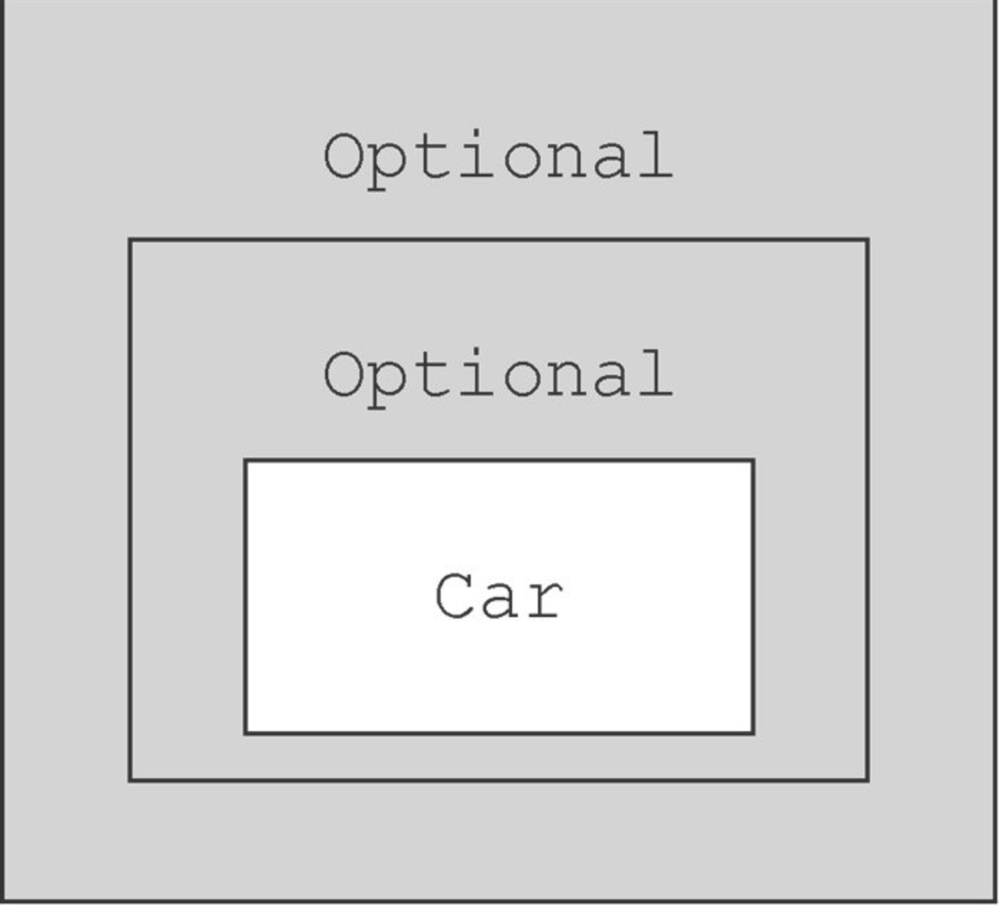

# Optional对象的使用

optional对象可以做一些事情让我们随时定位null的位置。

optional有很多方法，比较简单，这里只做一个简单介绍，比如

返回一个空的optinal对象

```java
Optional<Car> optCar = Optional.empty();
```

设置一个非null的对象，否则抛出来NullPointerException.

```java
Optional<Car> optCar = Optional.of(car);
```

设置一个可为null的optional对象

```java
Optional<Car> optCar = Optional.ofNullable(car);
```

## Optional的map方法

比如可以获取到某个对象里面的值

```java
Optional<Insurance> optInsurance = Optional.ofNullable(insurance);
Optional<String> name = optInsurance.map(Insurance::getName);
```

比如多个对象的时候呢？

```java
public class Person {
    private Optional<Car> car;       ←---- 人可能有汽车，也可能没有汽车，因此将这个字段声明为Optional
    public Optional<Car> getCar() { return car; }
}
public class Car {
    private Optional<Insurance> insurance;       ←---- 汽车可能进行了保险，也可能没有保险，所以将这个字段声明为Optional
    public Optional<Insurance> getInsurance() { return insurance; }
}
public class Insurance {
    private String name;       ←---- 保险公司必须有名字
    public String getName() { return name; }
}
```


```
Optional<Person> optPerson = Optional.of(person);
Optional<String> name =
    optPerson.map(Person::getCar)
             .map(Car::getInsurance)
             .map(Insurance::getName);
```

这个时候会报错，因为本身就返回getCar本身就返回了一个Optional<Car>所以出现了层层包裹的情况。



于是我们可以使用flatMap来做处理，把Optional中的元素给取出来。

```java
public String getCarInsuranceName(Optional<Person> person) {
    return person.flatMap(Person::getCar)
                 .flatMap(Car::getInsurance)
                 .map(Insurance::getName)
                 .orElse("Unknown");       ←---- 如果Optional的结果值为空，设置默认值
}
```


|       方法        |                             描述                             |
| :---------------: | :----------------------------------------------------------: |
|      `empty`      |                 返回一个空的`Optional` 实例                  |
|     `filter`      | 如果值存在并且满足提供的谓词，就返回包含该值的`Optional` 对象；否则返回一个空的`Optional` 对象 |
|     `flatMap`     | 如果值存在，就对该值执行提供的`mapping` 函数调用，返回一个`Optional` 类型的值，否则就返回一个空的`Optional` 对象 |
|       `get`       | 如果值存在，就将该值用`Optional` 封装返回，否则抛出一个`NoSuchElementException` 异常 |
|    `ifPresent`    |     如果值存在，就执行使用该值的方法调用，否则什么也不做     |
| `ifPresentOrElse` | 如果值存在，就以值作为输入执行对应的方法调用，否则执行另一个不需任何输入的方法；JDK9+ |
|    `isPresent`    |           如果值存在就返回`true` ，否则返回`false`           |
|       `map`       |       如果值存在，就对该值执行提供的`mapping` 函数调用       |
|       `of`        | 将指定值用`Optional` 封装之后返回，如果该值为`null` ，则抛出一个`NullPointerException` 异常 |
|   `ofNullable`    | 将指定值用`Optional` 封装之后返回，如果该值为`null` ，则返回一个空的`Optional` 对象 |
|       `or`        | 如果值存在，就返回同一个`Optional` 对象，否则返回由支持函数生成的另一个`Optional` 对象 |
|     `orElse`      |            如果有值则将其返回，否则返回一个默认值            |
|    `orElseGet`    | 如果有值则将其返回，否则返回一个由指定的`Supplier` 接口生成的值 |
|   `orElseThrow`   | 如果有值则将其返回，否则抛出一个由指定的`Supplier` 接口生成的异常 |
|     `stream`      | 如果有值，就返回包含该值的一个`Stream` ，否则返回一个空的`Stream`;JDK9+ |

## 注意事项

1. 因为Optional并没有实现serializable接口，所以它并不能被序列化，所以在序列号的过程中可能会发生错误。