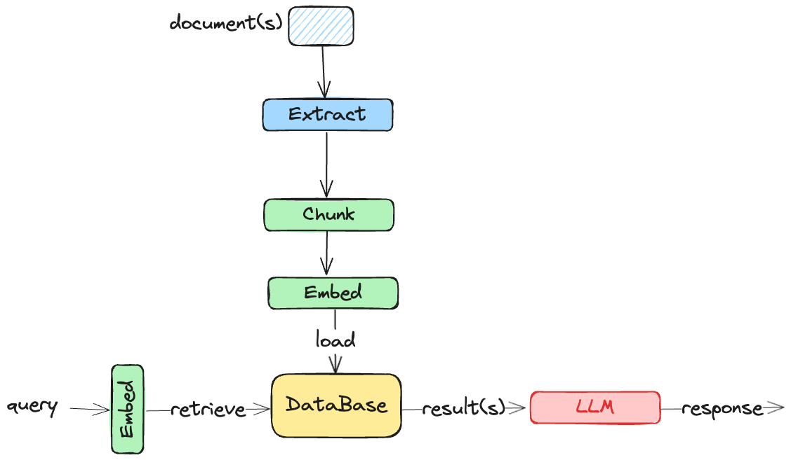

# AI相关的一些概念描述

## RAG

参考文档

```
https://www.deeplearning.ai/resources/generative-ai-courses-guide/
```

> Retrieval Augmented Generation(增强式检索);现在常用的是对文档的检索。

### RAG的流程

RAG的执行过程通常由两部分组成：

> 1. 解析文档到数据库，通常是一个向量数据库(vector database);
> 2. 检索数据库中的数据；

基本流程如下图



> - **Extract**: Documents come in all sorts of file formats (.doc, .pdf, etc.) and contain all sorts of data formats (text, tables, images, movies). These must be extracted and put into a format that can be processed by the next stages. 
> - **Chunking**: Text data is broken into smaller chunks – a process inventively named ‘chunking’.
> - **Embedding**: Converting a chunk into a ‘**dense vector**’ that represents the meaning of the text. 
> - **Loading:** Adding the embedding and original data to a database.
> - Database
>   - The database is going to provide storage for the embedding and data. Often these are **vector databases** due to the embedding, but **graph databases** and traditional databases are also used.
> - Query
>   - Embedding: The query is converted to a dense vector using the same embedding model.
>   - Retrieval: The stored and query vectors represent meaning, so retrieval is the process of finding the k entries in the database that are ‘closest’ to the query vector. Lots of details here!
>   - k results are provided to an LLM which uses them to form an ‘augmented’ response.

## Hugging Face

> Hugging Face Hub is an open platform that hosts models,datasets, and machine learning demos that are called Hugging Face Spaces.


## Transformer
