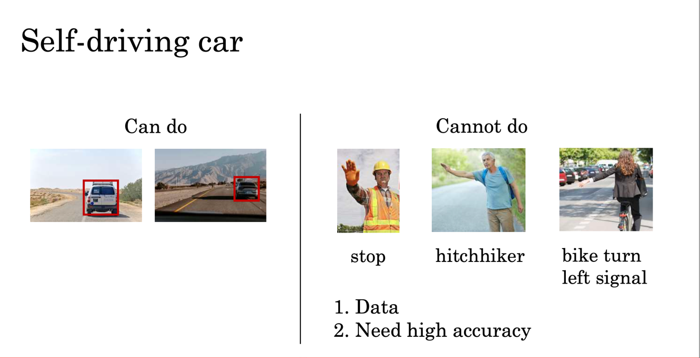
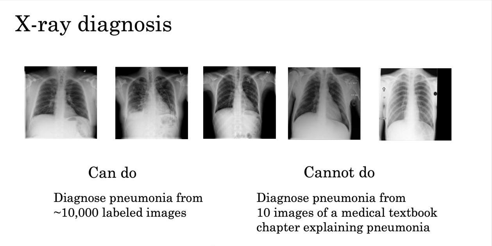

# What's AI?

AI contains following:

> 1. ANI;(artificial narrow intelligence) E.g., smart speaker, self-driving car, web search, AI in farming and factories
> 2. AGI;(artificial general intelligence) Do anything a human can do

## More examples of what machine learning can and cannot do

## Strengths and weaknesses of machine learning

> ML tends to work well when:
>
> 1. Learning a “simple” function 2. There is lots of data available
>
> ML tends to work poorly when:
>
> 1. Learning complex functions from small amounts of data
> 2. It is asked to perform on new types of data that it learned from