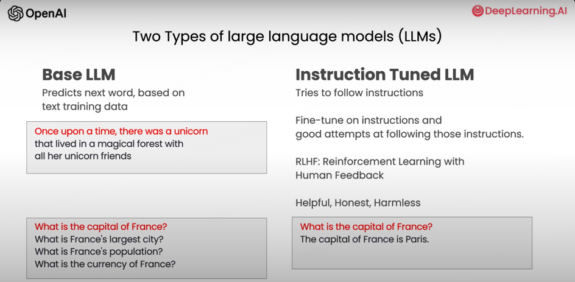
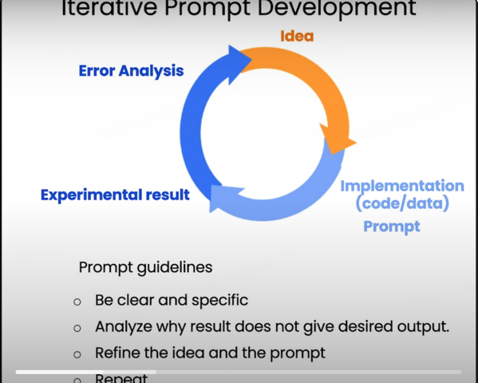

## 0-Introduction

1. Two types of large language models(LLMS)

   > - Base LLm
   > - Instruction tuned LLM

   

## 1-Guidelines

### Prompting Principles

> - **Principle 1: Write clear and specific instructions**
> - **Principle 2: Give the model time to “think”**

### Write clear and specific instructions

There are some tactics:

#### Tactic 1: Use delimiters to clearly indicate distinct parts of the input

> - Delimiters can be anything like: ```, """, < >, `<tag> </tag>`, `:`
>
> For example:
>
> > text = f"""
> > You should express what you want a model to do by \ 
> > providing instructions that are as clear and \ 
> > specific as you can possibly make them. \ 
> > This will guide the model towards the desired output, \ 
> > and reduce the chances of receiving irrelevant \ 
> > or incorrect responses. Don't confuse writing a \ 
> > clear prompt with writing a short prompt. \ 
> > In many cases, longer prompts provide more clarity \ 
> > and context for the model, which can lead to \ 
> > more detailed and relevant outputs.
> > """
> > prompt = f"""
> > Summarize the text delimited by triple backticks \ 
> > into a single sentence.
> > ```{text}```
> > """
> > response = get_completion(prompt)
> > print(response)

#### Tactic 2: Ask for a structured output

> - JSON, HTML
>
> > prompt = f"""
> > Generate a list of three made-up book titles along \ 
> > with their authors and genres. 
> > Provide them in JSON format with the following keys: 
> > book_id, title, author, genre.
> > """

#### Tactic 3: Ask the model to check whether conditions are satisfied

> text_1 = f"""
> Making a cup of tea is easy! First, you need to get some \ 
> water boiling. While that's happening, \ 
> grab a cup and put a tea bag in it. Once the water is \ 
> hot enough, just pour it over the tea bag. \ 
> Let it sit for a bit so the tea can steep. After a \ 
> few minutes, take out the tea bag. If you \ 
> like, you can add some sugar or milk to taste. \ 
> And that's it! You've got yourself a delicious \ 
> cup of tea to enjoy.
> """
> prompt = f"""
> You will be provided with text delimited by triple quotes. 
> If it contains a sequence of instructions, \ 
> re-write those instructions in the following format:
>
> Step 1 - ...
> Step 2 - …
> …
> Step N - …
>
> If the text does not contain a sequence of instructions, \ 
> then simply write \"No steps provided.\"
>
> \"\"\"{text_1}\"\"\"
> """
> response = get_completion(prompt)
> print("Completion for Text 1:")
> print(response)

#### Tactic 4: "Few-shot" prompting

> prompt = f"""
> Your task is to answer in a consistent style.
>
> <child>: Teach me about patience.
>
> <grandparent>: The river that carves the deepest \ 
> valley flows from a modest spring; the \ 
> grandest symphony originates from a single note; \ 
> the most intricate tapestry begins with a solitary thread.
>
> <child>: Teach me about resilience.
> """
> response = get_completion(prompt)
> print(response)

### Give the model time to “think”

#### Tactic 1: Specify the steps required to complete a task

> text = f"""
> In a charming village, siblings Jack and Jill set out on \ 
> a quest to fetch water from a hilltop \ 
> well. As they climbed, singing joyfully, misfortune \ 
> struck—Jack tripped on a stone and tumbled \ 
> down the hill, with Jill following suit. \ 
> Though slightly battered, the pair returned home to \ 
> comforting embraces. Despite the mishap, \ 
> their adventurous spirits remained undimmed, and they \ 
> continued exploring with delight.
> """
> # example 1
> prompt_1 = f"""
> Perform the following actions: 
> 1 - Summarize the following text delimited by triple \
> backticks with 1 sentence.
> 2 - Translate the summary into French.
> 3 - List each name in the French summary.
> 4 - Output a json object that contains the following \
> keys: french_summary, num_names.
>
> Separate your answers with line breaks.
>
> Text:
> ```{text}```
> """
> response = get_completion(prompt_1)
> print("Completion for prompt 1:")
> print(response)

#### Ask for output in a specified format

> prompt_2 = f"""
> Your task is to perform the following actions: 
> 1 - Summarize the following text delimited by 
>   <> with 1 sentence.
> 2 - Translate the summary into French.
> 3 - List each name in the French summary.
> 4 - Output a json object that contains the 
>   following keys: french_summary, num_names.
>
> Use the following format:
> Text: <text to summarize>
> Summary: <summary>
> Translation: <summary translation>
> Names: <list of names in summary>
> Output JSON: <json with summary and num_names>
>
> Text: <{text}>
> """
> response = get_completion(prompt_2)
> print("\nCompletion for prompt 2:")
> print(response)

#### Tactic 2: Instruct the model to work out its own solution before rushing to a conclusion

> prompt = f"""
> Determine if the student's solution is correct or not.
>
> Question:
> I'm building a solar power installation and I need \
>  help working out the financials. 
> - Land costs $100 / square foot
> - I can buy solar panels for $250 / square foot
> - I negotiated a contract for maintenance that will cost \ 
> me a flat $100k per year, and an additional $10 / square \
> foot
> What is the total cost for the first year of operations 
> as a function of the number of square feet.
>
> Student's Solution:
> Let x be the size of the installation in square feet.
> Costs:
> 1. Land cost: 100x
> 2. Solar panel cost: 250x
> 3. Maintenance cost: 100,000 + 100x
> Total cost: 100x + 250x + 100,000 + 100x = 450x + 100,000
> """
> response = get_completion(prompt)
> print(response)

#### Note that the student's solution is actually not correct.

#### We can fix this by instructing the model to work out its own solution first.

>prompt = f"""
>Your task is to determine if the student's solution \
>is correct or not.
>To solve the problem do the following:
>- First, work out your own solution to the problem including the final total. 
>- Then compare your solution to the student's solution \ 
>and evaluate if the student's solution is correct or not. 
>Don't decide if the student's solution is correct until 
>you have done the problem yourself.
>
>Use the following format:
>Question:
>```
>question here
>```
>Student's solution:
>```
>student's solution here
>```
>Actual solution:
>```
>steps to work out the solution and your solution here
>```
>Is the student's solution the same as actual solution \
>just calculated:
>```
>yes or no
>```
>Student grade:
>```
>correct or incorrect
>```
>
>Question:
>```
>I'm building a solar power installation and I need help \
>working out the financials. 
>- Land costs $100 / square foot
>- I can buy solar panels for $250 / square foot
>- I negotiated a contract for maintenance that will cost \
>me a flat $100k per year, and an additional $10 / square \
>foot
>What is the total cost for the first year of operations \
>as a function of the number of square feet.
>```
>Student's solution:
>```
>Let x be the size of the installation in square feet.
>Costs:
>1. Land cost: 100x
>2. Solar panel cost: 250x
>3. Maintenance cost: 100,000 + 100x
>Total cost: 100x + 250x + 100,000 + 100x = 450x + 100,000
>```
>Actual solution:
>"""
>response = get_completion(prompt)
>print(response)

### Model Limitations: Hallucinations
- Boie is a real company, the product name is not real.

## 2-Iterative

> In this lesson, you'll iteratively analyze and refine your prompts to generate marketing copy from a product fact sheet.

Iterate prompt's process



其实这个过程就是不断调试优化prompt的过程，比如刚开始只是指定要写一个关于衣服的fact sheet,后续然后就开始限定输出的字数，甚至可以让gpt以表格的形式来进行输出。

## 3-Summarizing(这里指的是对输入内容或者你感兴趣的总结)

### Text to summarize

```tex
prod_review = """
Got this panda plush toy for my daughter's birthday, \
who loves it and takes it everywhere. It's soft and \ 
super cute, and its face has a friendly look. It's \ 
a bit small for what I paid though. I think there \ 
might be other options that are bigger for the \ 
same price. It arrived a day earlier than expected, \ 
so I got to play with it myself before I gave it \ 
to her.
"""
```

### Summarize with a word/sentence/character limit

```text
prompt = f"""
Your task is to generate a short summary of a product \
review from an ecommerce site. 

Summarize the review below, delimited by triple 
backticks, in at most 30 words. 

Review: ```{prod_review}```
"""

response = get_completion(prompt)
print(response)
```

> 其实这个模块就是使用prompt来总结一些你想要总结的内容。可以把输入的东西变成一个变量，然后集成到prompt中，然后让其进行输出。

## 4-Inferring

> In this lesson, you will infer sentiment and topics from product reviews and news articles.

> 其实这个课程也是prompt的组合而已，只不过是情感相关的prompt。

```text
lamp_review = """
Needed a nice lamp for my bedroom, and this one had \
additional storage and not too high of a price point. \
Got it fast.  The string to our lamp broke during the \
transit and the company happily sent over a new one. \
Came within a few days as well. It was easy to put \
together.  I had a missing part, so I contacted their \
support and they very quickly got me the missing piece! \
Lumina seems to me to be a great company that cares \
about their customers and products!!
"""
```

#### Sentiment (positive/negative)

```text
prompt = f"""
What is the sentiment of the following product review, 
which is delimited with triple backticks?

Review text: '''{lamp_review}'''
"""
response = get_completion(prompt)
print(response)
```

#### Identify types of emotions

```python
prompt = f"""
Identify a list of emotions that the writer of the \
following review is expressing. Include no more than \
five items in the list. Format your answer as a list of \
lower-case words separated by commas.

Review text: '''{lamp_review}'''
"""
response = get_completion(prompt)
print(response)
```

#### Extract product and company name from customer reviews

```python
prompt = f"""
Identify the following items from the review text: 
- Item purchased by reviewer
- Company that made the item

The review is delimited with triple backticks. \
Format your response as a JSON object with \
"Item" and "Brand" as the keys. 
If the information isn't present, use "unknown" \
as the value.
Make your response as short as possible.
  
Review text: '''{lamp_review}'''
"""
response = get_completion(prompt)
print(response)
```

#### Doing multiple tasks at once

```python
prompt = f"""
Identify the following items from the review text: 
- Sentiment (positive or negative)
- Is the reviewer expressing anger? (true or false)
- Item purchased by reviewer
- Company that made the item

The review is delimited with triple backticks. \
Format your response as a JSON object with \
"Sentiment", "Anger", "Item" and "Brand" as the keys.
If the information isn't present, use "unknown" \
as the value.
Make your response as short as possible.
Format the Anger value as a boolean.

Review text: '''{lamp_review}'''
"""
response = get_completion(prompt)
print(response)
```

## 5-Transforming

> In this notebook, we will explore how to use Large Language Models for text transformation tasks such as language translation, spelling and grammar checking, tone adjustment, and format conversion.

### Translation

~~~python
prompt = f"""
Translate the following English text to Spanish: \ 
```Hi, I would like to order a blender```
"""
response = get_completion(prompt)
print(response)
~~~

### Format Conversion

```python
data_json = { "resturant employees" :[ 
    {"name":"Shyam", "email":"shyamjaiswal@gmail.com"},
    {"name":"Bob", "email":"bob32@gmail.com"},
    {"name":"Jai", "email":"jai87@gmail.com"}
]}

prompt = f"""
Translate the following python dictionary from JSON to an HTML \
table with column headers and title: {data_json}
"""
response = get_completion(prompt)
print(response)
```

### Spellcheck/Grammar check.

~~~python
text = [ 
  "The girl with the black and white puppies have a ball.",  # The girl has a ball.
  "Yolanda has her notebook.", # ok
  "Its going to be a long day. Does the car need it’s oil changed?",  # Homonyms
  "Their goes my freedom. There going to bring they’re suitcases.",  # Homonyms
  "Your going to need you’re notebook.",  # Homonyms
  "That medicine effects my ability to sleep. Have you heard of the butterfly affect?", # Homonyms
  "This phrase is to cherck chatGPT for speling abilitty"  # spelling
]
for t in text:
    prompt = f"""Proofread and correct the following text
    and rewrite the corrected version. If you don't find
    and errors, just say "No errors found". Don't use 
    any punctuation around the text:
    ```{t}```"""
    response = get_completion(prompt)
    print(response)
~~~

## 6-Expanding

> In this lesson, you will generate customer service emails that are tailored to each customer's review.

### Customize the automated reply to a customer email

```text
# given the sentiment from the lesson on "inferring",
# and the original customer message, customize the email
sentiment = "negative"

# review for a blender
review = f"""
So, they still had the 17 piece system on seasonal \
sale for around $49 in the month of November, about \
half off, but for some reason (call it price gouging) \
around the second week of December the prices all went \
up to about anywhere from between $70-$89 for the same \
system. And the 11 piece system went up around $10 or \
so in price also from the earlier sale price of $29. \
So it looks okay, but if you look at the base, the part \
where the blade locks into place doesn’t look as good \
as in previous editions from a few years ago, but I \
plan to be very gentle with it (example, I crush \
very hard items like beans, ice, rice, etc. in the \ 
blender first then pulverize them in the serving size \
I want in the blender then switch to the whipping \
blade for a finer flour, and use the cross cutting blade \
first when making smoothies, then use the flat blade \
if I need them finer/less pulpy). Special tip when making \
smoothies, finely cut and freeze the fruits and \
vegetables (if using spinach-lightly stew soften the \ 
spinach then freeze until ready for use-and if making \
sorbet, use a small to medium sized food processor) \ 
that you plan to use that way you can avoid adding so \
much ice if at all-when making your smoothie. \
After about a year, the motor was making a funny noise. \
I called customer service but the warranty expired \
already, so I had to buy another one. FYI: The overall \
quality has gone done in these types of products, so \
they are kind of counting on brand recognition and \
consumer loyalty to maintain sales. Got it in about \
two days.
"""
```

Compose prompt

```python
prompt = f"""
You are a customer service AI assistant.
Your task is to send an email reply to a valued customer.
Given the customer email delimited by ```, \
Generate a reply to thank the customer for their review.
If the sentiment is positive or neutral, thank them for \
their review.
If the sentiment is negative, apologize and suggest that \
they can reach out to customer service. 
Make sure to use specific details from the review.
Write in a concise and professional tone.
Sign the email as `AI customer agent`.
Customer review: ```{review}```
Review sentiment: {sentiment}
"""
response = get_completion(prompt)
print(response)
```

#### Remind the model to use details from the customer's email

```sql
prompt = f"""
You are a customer service AI assistant.
Your task is to send an email reply to a valued customer.
Given the customer email delimited by ```, \
Generate a reply to thank the customer for their review.
If the sentiment is positive or neutral, thank them for \
their review.
If the sentiment is negative, apologize and suggest that \
they can reach out to customer service. 
Make sure to use specific details from the review.
Write in a concise and professional tone.
Sign the email as `AI customer agent`.
Customer review: ```{review}```
Review sentiment: {sentiment}
"""
response = get_completion(prompt, temperature=0.7)
print(response)
```

## 7-ChatBot

> In this notebook, you will explore how you can utilize the chat format to have extended conversations with chatbots personalized or specialized for specific tasks or behaviors.

Example-1

```python
messages =  [  
{'role':'system', 'content':'You are an assistant that speaks like Shakespeare.'},    
{'role':'user', 'content':'tell me a joke'},   
{'role':'assistant', 'content':'Why did the chicken cross the road'},   
{'role':'user', 'content':'I don\'t know'}  ]
```

Example-2

```python
import panel as pn  # GUI
pn.extension()

panels = [] # collect display 

context = [ {'role':'system', 'content':"""
You are OrderBot, an automated service to collect orders for a pizza restaurant. \
You first greet the customer, then collects the order, \
and then asks if it's a pickup or delivery. \
You wait to collect the entire order, then summarize it and check for a final \
time if the customer wants to add anything else. \
If it's a delivery, you ask for an address. \
Finally you collect the payment.\
Make sure to clarify all options, extras and sizes to uniquely \
identify the item from the menu.\
You respond in a short, very conversational friendly style. \
The menu includes \
pepperoni pizza  12.95, 10.00, 7.00 \
cheese pizza   10.95, 9.25, 6.50 \
eggplant pizza   11.95, 9.75, 6.75 \
fries 4.50, 3.50 \
greek salad 7.25 \
Toppings: \
extra cheese 2.00, \
mushrooms 1.50 \
sausage 3.00 \
canadian bacon 3.50 \
AI sauce 1.50 \
peppers 1.00 \
Drinks: \
coke 3.00, 2.00, 1.00 \
sprite 3.00, 2.00, 1.00 \
bottled water 5.00 \
"""} ]  # accumulate messages


inp = pn.widgets.TextInput(value="Hi", placeholder='Enter text here…')
button_conversation = pn.widgets.Button(name="Chat!")

interactive_conversation = pn.bind(collect_messages, button_conversation)

dashboard = pn.Column(
    inp,
    pn.Row(button_conversation),
    pn.panel(interactive_conversation, loading_indicator=True, height=300),
)

dashboard
```

## 8-Conclusion

Principles:

- Write clear and specific instructions
- Give the model time to "think"

Iteractive prompt development

Capabilities: Summarzing, inferring, transforming, expanding

Build a chatbot

