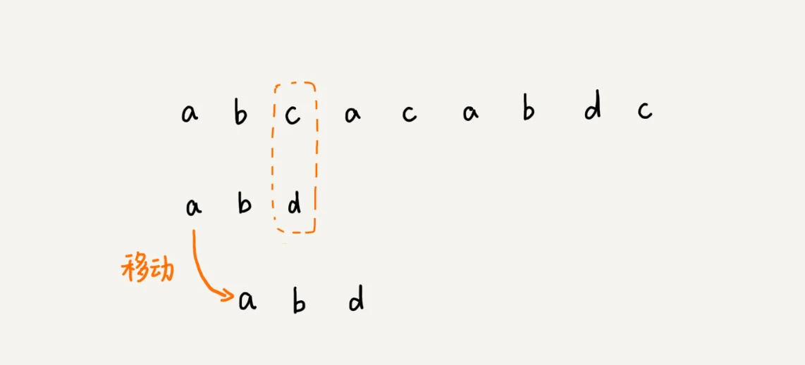

## 复杂度分析

### 为什么需要复杂度分析

> 有人说可以通过让代码跑一遍，然后进行统计和监控来得到结果。然后跑多次来进行结果的对比。这种方法叫做**事后统计法**。
>
> 这种方法有很严重的缺陷：
>
> > 1. 测试结果非常依赖于环境；
> > 2. 测试结果非常受数据规模的影响；

### 大O复杂度表示法

> 不运行代码的情况下，一眼能看出来代码的执行效率。

方法可以把代码运行的每一行代码的时间都认为是时间一样的，暂且当做unit_time。那么以下代码执行了多长时间呢：

```java
 int cal(int n) {
   int sum = 0;
   int i = 1;
   for (; i <= n; ++i) {
     sum = sum + i;
   }
   return sum;
 }
```

最后的时间是(2n+2)*unit_time。

```java
 int cal(int n) {
   int sum = 0;
   int i = 1;
   int j = 1;
   for (; i <= n; ++i) {
     j = 1;
     for (; j <= n; ++j) {
       sum = sum +  i * j;
     }
   }
 }
```

以上的代码的执行时间为：T(n) = (2n2+2n+3)*unit_time。

> 而不管是(2n+2)*unit_time还是(2n2+2n+3)*unit_time。我们都可以把其描述为f(n)的一个函数。
>
> 即大O表示O(f(n));更具体的解释为：O(2n+2)和O(2n2+2n+3)。
>
> 通常只需要考虑增长最快的因素即可，常量、系数已经变化较小的公式都可以舍去，于是上面的大O表示法可以表示为：T(n) = O(n)； T(n) = O(n2)

需要注意的是，这个大O表示法并不直接代表代码运行的时间，**它只是代表随着数据规模的变化而代码执行消耗时间的趋势**，叫做渐进时间复杂度也叫时间负责度。

快速判断时间复杂度的小技巧：

> 只关注运行代码随着数据规模增长最快的部分即可。

常见的时间复杂度案例分析


上面的复杂度可以分为两种：多项式量级和非多项式量级。

> 当数据规模 n 越来越大时，非多项式量级算法的执行时间会急剧增加，求解问题的执行时间会无限增长。所以，非多项式时间复杂度的算法其实是非常低效的算法。

### O(1)

O(1)并不是只执行了一行代码，只是常量级的时间复杂度表示方法。如下代码：

```java
 int i = 8;
 int j = 6;
 int sum = i + j;
```

> 只要代码的执行时间不随 n 的增大而增长，这样代码的时间复杂度我们都记作 O(1)。或者说，一般情况下，只要算法中不存在循环语句、递归语句，即使有成千上万行的代码，其时间复杂度也是Ο(1)。

### O(logn)、O(nlogn)

```java
 i=1;
 while (i <= n)  {
   i = i * 2;
 }
```

其实我们就是这个循环里面的代码执行了几次：x=log2n；

```java
 i=1;
 while (i <= n)  {
   i = i * 3;
 }
// 这段代码的时间复杂度为 O(log3n)。
```

不管是以 2 为底、以 3 为底，还是以 10 为底，我们可以把所有对数阶的时间复杂度都记为 O(logn)。

如果一段代码的时间复杂度是 O(logn)，我们循环执行 n 遍，时间复杂度就是 O(nlogn) 了;

### O(m+n)、O(m*n)

```java
int cal(int m, int n) {
  int sum_1 = 0;
  int i = 1;
  for (; i < m; ++i) {
    sum_1 = sum_1 + i;
  }

  int sum_2 = 0;
  int j = 1;
  for (; j < n; ++j) {
    sum_2 = sum_2 + j;
  }

  return sum_1 + sum_2;
}
```

>m 和 n 是表示两个数据规模。我们无法事先评估 m 和 n 谁的量级大，所以我们在表示复杂度的时候，就不能简单地利用加法法则，省略掉其中一个。所以，上面代码的时间复杂度就是 O(m+n)。
>
>针对这种情况，原来的加法法则就不正确了，我们需要将加法规则改为：T1(m) + T2(n) = O(f(m) + g(n));
>
>但是乘法法则继续有效：T1(m)*T2(n) = O(f(m) * f(n))。


## 更详细的时间复杂度分析

> - 最好情况时间复杂度
> - 最坏情况时间复杂度
> - 平均情况时间复杂度
> - 均摊时间复杂度

## 数组：为什么很多编程语言的数组都是从0开始的

什么是数组？

> 数组（Array）是一种**线性表数据结构**。它用一组**连续的**内存空间，来存储一组具有**相同类型**的数据;

> a[k]_address = base_address + k * type_size
>
> a[k]_address = base_address + (k-1)*type_size
>
> 从 1 开始编号，每次随机访问数组元素都多了一次减法运算，对于 CPU 来说，就是多了一次减法指令。
>
> 其中的k代表的是首地址。比如a[0]代表的首字母是0

## 链表

链表的分类

> 1. 单向链表；
> 2. 单向循环链表；
> 3. 双向链表；


一些误区

> 1. 既然链表的**删除**是O(1),那么单向链表和双向链表的删除效率是一样的？因为还需要进行查询，所以查询的时间是O(n),但是如果制定某个节点，那么双向链表查询就是O(1),因为它天然存储了上一个节点指针。
> 2. 链表的删除主要的时间其实都浪费在查询上了。

链表和数组的区别

> 链表是不需要连续内存的；而数组是需要连续内存的；
>
> 链表添加和删除数据消耗较小，而数组添加和删除开销严重；

LRU的实现方式

> 1. 如果此数据之前已经被缓存在链表中了，我们遍历得到这个数据对应的结点，并将其从原来的位置删除，然后再插入到链表的头部。2. 如果此数据没有在缓存链表中，又可以分为两种情况：如果此时缓存未满，则将此结点直接插入到链表的头部；如果此时缓存已满，则链表尾结点删除，将新的数据结点插入链表的头部。这样我们就用链表实现了一个 LRU 缓存，是不是很简单？

### 常见的链表算法

- 单链表反转 
- 链表中环的检测
- 两个有序的链表合并
- 删除链表倒数第 n 个结点
- 求链表的中间结点


### 理解指针和引用的含义

指针和引用其实含义是一样的，其实都是指的是通过这个地址能够找到这个内存中对象的存储位置；

比如链表中一些常见的一些含义：

> 1. p->next=q;表达的意思是 p的next指针存储了q节点的内存地址；
> 2. p->next=p->next->next;p节点的next节点的引用存储着p节点的下下节点内存地址；

### 警惕指针丢失和内存泄漏

下面拿单链表举例说明,比如我想在a,b节点之间插入一个x节点,假设当前的指针为p


常见的错误代码如下：

```
p->next=x
x->next=p->next
```

> 上面的代码其实就是一个常见的错误；
>
> > 当执行 x->next=p->next 的时候，其实由于上一行代码已经把p的下一个节点设置成x了，其实x->next就是x它自己。所以造成后面的链表都无法访问到；
>
> 解决方案1：
>
> > 先让x的下一个节点指向b，然后再让p的下一个节点指向x；也就是上面的错误代码调换下顺序。
>
> 解决方案2：
>
> > 先使用一个临时变量来存储下b节点；
> >
> > 代码编程这样了
> >
> > temp=p->next
> >
> > p->next=x
> >
> > x->next=temp
>
> **插入的时候要考虑自己是不是第一个节点**

删除节点比较简单

> p->next=p->next->next

但是要考虑是不是最后一个节点；

链表翻转的代码实现

```java
// 使用while循环
@Data
public class NewNode {

    private String data;


    private NewNode next;


    public static void main(String[] args) {
        NewNode node1 = new NewNode();
        node1.setData("node1");

        NewNode node2 = new NewNode();
        node2.setData("node2");

        NewNode node3 = new NewNode();
        node3.setData("node3");

        node1.setNext(node2);
        node2.setNext(node3);

        NewNode verseLinkList = verseLinkList(node1);

        print(verseLinkList);
    }


    public static void print(NewNode newNode){
        NewNode next=newNode;
        while (true){
            System.out.println(next.getData());
            if (next.next==null){
                return;
            }
            next=next.next;
        }
    }


    public static NewNode verseLinkList(NewNode newNode){
        NewNode pre=null;
        NewNode currentNode=newNode;
        while (true){
            if (currentNode==null){
                break;
            }
            NewNode temp=currentNode.next;
            currentNode.next=pre;
            pre=currentNode;
            currentNode=temp;
        }
        return pre;
    }
}
```


```java
// 递归
public static NewNode  reverseLinkedList(NewNode pre,NewNode newPoint){
        if (newPoint.next==null){
            newPoint.next=pre;
            return newPoint;
        }

        NewNode nextNode=newPoint.next;

        // 翻转
        newPoint.next=pre;

        return reverseLinkedList(newPoint,nextNode);
    }
```


### 两个有序链表组合成一个有序链表

> 实现要点：
>
> 1. 创建一个head头结点
> 2. 创建合并后链表的指针；创建第一个链表的指针；创建第二个链表的指针；
> 3. 移动两个有序列表的指针
> 4. 设置头结点，**移动和更新** 合并节点的指针

```java
/**
     * 1. 创建一个merge的list
     * 2. 创建两个指针，这两个指针 分别指向 两个链表 各个节点
     * 3. 进行判断和指针的异动
     * @return
     */
    public static NewNode merge(NewNode sortLinkedList1,NewNode sortLinkedList2){
        NewNode head=null;// 头节点
        NewNode mergeP=null;// 合并的指针
        NewNode p1=sortLinkedList1;
        NewNode p2=sortLinkedList2;

        while (p1!=null && p2!=null){

            NewNode temp=new NewNode();
            // 比较
            int value1=Integer.parseInt(p1.getData());
            int value2=Integer.parseInt(p2.getData());
            if (value1<value2){
                temp.setData(value1+"");
                // 移动p1指针
                p1=p1.next;
            }else if (value1>=value2){// 小于或者等于 都异动p2的指针
                temp.setData(value2+"");
                p2=p2.next;
            }

            if (head==null){
                head=temp;
                mergeP=head;
            }else {
                mergeP.next=temp;
                mergeP=temp;
            }

        }

        // 处理边界值（这个处理方式虽然能够达到效果，但是有个问题就是现在合并的链表和原来的链表使用共同的引用）
        if (p1 != null) {
            mergeP.next = p1;
        } else if (p2 != null) {
            mergeP.next = p2;
        }
        return head;
    }
```

优化的边界处理问题

```java
				// 处理边界值
        if (p1 != null) {
            while (p1 != null) {
                NewNode newNode = new NewNode();
                newNode.setData(p1.getData());
                mergeP.next = newNode;
                p1 = p1.next;
            }
        } else if (p2 != null) {
            while (p2 != null) {
                NewNode newNode = new NewNode();
                newNode.setData(p2.getData());
                mergeP.next = newNode;
                p2 = p2.next;
            }
        }
```


## Hash算法

> 任意长度的二进制字符串映射为固定长度的二进制字符串，这个映射规则就叫做hash算法。

Hash算法一般满足以下要求

> - hash值不能反向推导出来原始数据
> - 对数据敏感，哪怕修改任何一个bit的数据都会导致结果大不一样
> - 散列的冲突要小，对于不同的原始数据，hash值的冲突率要小
> - hash算法的执行效率要高，针对长文本也能够快速得到hash值

### Hash算法应用

#### 安全加密

常用于加密的算法有MD5,SHA,DES,AES

> hash算法有两个重要的特性：
>
> 1. 无法通过hash值来反推原始值
> 2. 对于不同的值冲突尽量的少
>
> 而对于`不同的值冲突尽量的少`，其实是从数学上来解释的。因为hash的值是固定的，而输出的值可以是无限的，所以理论上来说肯定是会有不同的值冲突的。只不过概率可能很小。
>
> 比如前面举的 MD5 的例子，哈希值是固定的 128 位二进制串，能表示的数据是有限的，最多能表示 2^128 个数据，而我们要哈希的数据是无穷的。基于鸽巢原理，如果我们对 2^128+1 个数据求哈希值，就必然会存在哈希值相同的情况。

#### 唯一标识

>  判断视频和图片是否存在过,可以对视频或者图片做hash从而来判断这个文件是存在过。

#### 数据校验

> 比如电驴上下来一个2G的电影，但是需要分成100个块。于是这个种子上有这100个文件的hash值，当100个文件下载好之后，再进行hash，然后对比种子种的hash值是否一样，如果不一样就认为此文件被修改过，需要再次从服务器上下载。

#### 散列函数

比如HashMap的实现。而这种方式其实不关心值是否会重复，散列更关注的是是否能够均匀的分配到各个槽之中。

> 对于密码的“脱库”，其实仅仅使用SHA等加密算法还是不够的，因为有些用户的密码实在太简单，比如“0000”，“123456”之类的，如果黑客有个常用的字典表然后去强烈破解，那么就会得到相对于的密码（虽然从理论上来讲，这个破解的密码不一定是用户的密码，应为hash是有几率冲突的）
>
> 所以还需要引入一个salt来增加密码的安全性。

## 排序算法

排序算法要点

> 1. 要关心排序算法的最好复杂度，最坏复杂度和平均复杂度。
> 2. 现实工作中的数据量都比较小，比如是几百个或者1000个这个时候就需要把常量和其他系数考虑进来。
> 3. 考虑是否是原地算法，看空间的复杂度是否为O(1)。

### 冒泡排序

> 每次排序一个元素，按照最大或者最小进行排序。这里能优化的地方在于，如果有一轮没有进行位置的交换，那么则证明这个排序已经排序好了。

```java
public static void main(String[] args) {
        int[] array=new int[]{1,5,8,7,9,0};

        for (int i = 0; i < array.length-1; i++) {// 6个元素只需要比较5次即可
            for (int j = 0; j < array.length-1-i; j++) {// 实际比较的次数
                if (array[j]>array[j+1]){
                    int tem=array[j+1];
                    array[j+1]=array[j];
                    array[j]=tem;
                }
            }
        }

        Arrays.stream(array).forEach(System.out::println);
    }
```

### 插入排序

核心思路

> 一个程序或者算法最核心的就是思路，其实就是一步步该怎么做。这就需要抓住关键知识点，如果思路不清晰的时候还可以依赖图示进行辅助自己思路。
>
> 插入排序的核心思路是这样的：
>
> > 1. 把需要排序的列表分为两部分：已经排序的部分+待排序的部分。
> > 2. 数据是从后向前进行比较，然后符合条件的进行移动。


```java
public static void insertSort(int[] array){
        /**
         * 第一个循环是指向要移动的元素
         * 第二个循环是每个元素要和之前已经排好的进行比较然后进行插入
         */
        for (int i = 1; i < array.length; i++) {
            int n1=i-1;
            int a=array[i];
            for (;n1>=0;n1--){
                int b=array[n1];
                if (a<b){// 如果当前的元素比比较的元素值小，那么进行移动
                    array[n1+1]=array[n1];
                }else{
                    break;
                }
            }

            // 插入(这里不确定是否加1，那么可以随便找个数字来带入下得出结论)
            array[n1+1]=a;
        }
    }
```

### 适合大数据规模的排序

> 冒泡排序，插入排序这些排序算法的复杂度是O(n2)；
>
> 而快速排序和归并排序的时间复杂度是O(nlogn).

快速排序

```java
public static void main(String[] args) {
        int[] array=new int[]{1,6,3,9,0};


        quickSorted(array,0,array.length-1);

        System.out.println(Arrays.toString(array));
    }


    public static void quickSorted(int[] array,int left,int right){
        if (left>=right) return;
        int partition = partition(array, left, right);
        quickSorted(array,left,partition-1);

        quickSorted(array,partition+1,right);
    }


    public static int partition(int[] array,int left,int right){
        int point=left;
        int index=left+1;
        for (int j = index; j <= right; j++) {
            if (array[j]>array[point]){
                // 交换
                int temp=array[j];
                array[j]=array[index];
                array[index]=temp;
                index++;
            }
        }

        // 基准点与最后一个进行交换
        int temp=array[point];
        array[point]=array[index-1];
        array[index-1]=temp;

        return index-1;
    }
```

课后题

> 现在你有 10 个接口访问日志文件，每个日志文件大小约 300MB，每个文件里的日志都是按照时间戳从小到大排序的。你希望将这 10 个较小的日志文件，合并为 1 个日志文件，合并之后的日志仍然按照时间戳从小到大排列。如果处理上述排序任务的机器内存只有 1GB，你有什么好的解决思路，能“快速”地将这 10 个日志文件合并吗？

思路就是把10个文件放到最小堆里面，每次取一个最小的值放到最新的文件中。

## 二分法查找

> 1. 时间复杂度为O(logn)，查询的效率极其的高。
> 2. 二分查找依赖的是数组，而如果是链表就不可以。因为链表对数据的查找复杂度是0(n),而数组的复杂度是0(1)
> 3. 查找的数组是有序的
> 4. 数据太少不适合使用，可以进行挨个进行查找即可
> 5. 数据太大也不适合，因为二分查找必须是数组，所以需要连续的内存空间；比如有个2G的数据，但是内存只有1G，那么这个时候是不适合使用二分查找的。

while循环版本

```java
/**
     *
     * @param array 数组
     * @param n 数组大小
     * @param searchValue 需要寻找的值
     * @return 数组的下标
     */
    public static int binSearchWhile(int[] array,int n,int searchValue){
        int low=0;
        int high=n-1;
        while (low<=high){
            int middle=(low+high)/2;
            if (array[middle]==searchValue){
                return middle;
            }else if (array[middle]>searchValue){
                high=middle-1;
            }else {
                low=middle+1;
            }
        }

        return -1;
    }
```

recursion

```java
    public static int binSearchRecursion(int[] array,int low,int high,int searchValue){
        if (low > high) return -1;
        int middle=(low+high)/2;
        if (array[middle]==searchValue){
            return middle;
        }else if (array[middle]>searchValue){
            return binSearchRecursion(array,low,middle-1,searchValue);
        }else {
            return binSearchRecursion(array,middle+1,high,searchValue);
        }
    }
```

## 二分查找的变种


### 整体思路

> 在二分法的基础上，来分别对上面的首个和最后一个做相应的变种；
>
> 比如首个的话，就判断middle是否等于0或者前面的一个数据是否满足要求；

### 第一个等于查找值

```java
public static int findFirstEqualValue(int[] array,int n,int searchValue){
        int low=0;
        int high=n-1;
        while (low<=high){
            int middle=(low+high)/2;
            if (array[middle]==searchValue){
                /**
                 * middle==0或者前一个不等于searchValue 即可以判断是否为第一个等于的值
                 */
                if (middle==0 || array[middle-1]!=searchValue){
                    return middle;
                }else {// 说明在左边，更新high的值
                    high=middle-1;
                }

            }else if (array[middle]>searchValue){
                high=middle-1;
            }else {
                low=middle+1;
            }
        }

        return -1;
    }
```

### 最后一个等于查找值

```java
public static int findLastEqualValue(int[] array,int n,int searchValue){
        int low=0;
        int high=n-1;
        while (low<=high){
            int middle=(low+high)/2;
            if (array[middle]==searchValue){
                /**
                 * 最后一个元素或者middle+1的数据不等于目标值
                 */
                if (middle==(n-1) || array[middle+1]!=searchValue){
                    return middle;
                }else {// 不是最后一个，只能在右边
                    low=middle+1;
                }
            }else if (array[middle]>searchValue){
                high=middle-1;
            }else{
                low=middle+1;
            }
        }
        return -1;
    }
```

### 第一个大于查找值

```java
public static int findFirstGreatValue(int[] array,int n,int searchValue){
        int low=0;
        int high=n-1;
        while (low<=high){
            int middle=(low+high)/2;
            if (array[middle]==searchValue){// 在右侧
                low=middle+1;
            }else if (array[middle]>searchValue){
                if (middle==0 || array[middle-1]<=searchValue){
                    return middle;
                }else {
                    // 在左侧
                    high=middle-1;
                }
            }else {
                low=middle+1;
            }
        }

        return -1;
    }
```

## 一些常见的优化查找策略

### 桶策略

> 桶其实分为两种：
>
> - 一个桶是一个值区间；比如订单金额，可以按照金额的区间来设计桶；
> - 一个值一个区间；这种适合数字比较少的情况，比如高考的分数排名；

## 散列表

> 有个需求是这样的：
>
> > 当自己在word软件中拼写英文单词的时候，如何快速校验这个拼写对不对呢？
>
> 这个就是设计到散列表

解决散列表冲突的方式

- 开放寻址法(open addressing)
- 链表法

开放寻址法

> 逻辑就是当通过hash之后，那个位置已经存在数据，那么就需要向后进行查找，然后找到有空位的位置，然后放进去。但是缺点也很明显，这样的做法随着数据量的增加，那么剩下的空位会越来越少。

链表法

> 每个桶的位置后面有一个链表，然后在这个链表上进行添加或者删除；

## 树(Tree)

树是一个非线性的数据结构；树有哪些特征？哪些结构是符合树的定义呢？


节点的一些概念

> 1. 父节点；
> 2. 子节点；
> 3. 根节点；没有父节点的节点；
> 4. 兄弟节点；同一个父节点的节点；
> 5. 叶子节点；没有子节点的节点

树的常用术语

- 深度（最底层的叶子节点深度最大，节点的个数）
- 高度（最顶部的跟节点高度最高，节点的个数）
- 层数（通过一个节点到叶子节点最大的节点数量）


### 二叉树

> 二叉树就是每个父节点下面最多有两个子节点，二叉树是我们常用的数据结构。

二叉树分类

- 满二叉树；叶子节点都在最后一层，除了叶子节点之外，每个节点都有左右两个子节点；编号2符合这个要求
- 完全二叉树；叶子节点都在最底层两层，最后一层的叶子节点都靠左侧，并且除了最后一层，其他层的节点数量都要达到最大。


判断哪些是完全二叉树


为何偏偏是靠左的节点才是满二叉树呢？而不是靠右呢？

> 这涉及到了树的存储。

数的存储方式

> 1. 链式存储法；
> 2. 顺序存储法；（使用数组来进行存储）

链式存储法


顺序存储法


> 根据上面的推算，我们能够得出结论：
>
> 我们把根节点存储在下标 i = 1 的位置，那左子节点存储在下标 2 * i = 2 的位置，右子节点存储在 2 * i + 1 = 3 的位置。以此类推，B 节点的左子节点存储在 2 * i = 2 * 2 = 4 的位置，右子节点存储在 2 * i + 1 = 2 * 2 + 1 = 5 的位置。
>
> 单单看最最左侧的一列其实可以表示为2的N次方。

### 二叉树的遍历

> 前序遍历、中序遍历和后序遍历。
>
> 其实这个没有必要进行记忆，因为这个遍历本质上就是一个递归的实现，然后调换下打印顺序。如果真想记，那么记住其中的一个`前序遍历`即可，这个前序遍历值得是先打印自己，然后再打印左节点，然后再打印右节点。
>
> 如果真想记忆，这里有个小诀窍，就是自己打印的顺序，自己先打印则是前序，自己第二打印则是中序排序，自己最后打印则是后序遍历。


```java
void preOrder(Node* root) {
  if (root == null) return;
  print root // 此处为伪代码，表示打印root节点
  preOrder(root->left);
  preOrder(root->right);
}

void inOrder(Node* root) {
  if (root == null) return;
  inOrder(root->left);
  print root // 此处为伪代码，表示打印root节点
  inOrder(root->right);
}

void postOrder(Node* root) {
  if (root == null) return;
  postOrder(root->left);
  postOrder(root->right);
  print root // 此处为伪代码，表示打印root节点
}
```

### 二叉查找树(Binary Search Tree)

> 二叉查找树的特点是：支持动态数据集合的快速插入、删除和查找操作。

二叉查找树的定义

> 树中的任意节点，左侧的值小于当前值，右侧的值大于当前值。


#### 查找

> 先取root节点数据，然后根据左边小于root节点，右边大于root节点来进行循环遍历；


```java
public class BinarySearchTree {
  private Node tree;

  public Node find(int data) {
    Node p = tree;
    while (p != null) {
      if (data < p.data) p = p.left;
      else if (data > p.data) p = p.right;
      else return p;
    }
    return null;
  }

  public static class Node {
    private int data;
    private Node left;
    private Node right;

    public Node(int data) {
      this.data = data;
    }
  }
}
```

#### 二叉查找树插入

原理

> 从root节点开始，如果插入的数据大于当前节点，那么向右，如果右边的节点为空直接插入，不为空则继续遍历。
>
> 如果插入的数据小于当前节点，向左，如果左边的节点为空，则直接插入，否则继续查找直到找到合适为止。

```java
public void insert(int data) {
  if (tree == null) {
    tree = new Node(data);
    return;
  }

  Node p = tree;
  while (p != null) {
    if (data > p.data) {
      if (p.right == null) {
        p.right = new Node(data);
        return;
      }
      p = p.right;
    } else { // data < p.data
      if (p.left == null) {
        p.left = new Node(data);
        return;
      }
      p = p.left;
    }
  }
}
```

#### 删除

> 删除分为三种情况：
>
> 1. 当删除的节点没有子节点的时候，直接把当前直接的引用设置为null即可；
> 2. 当删除的节点有一个子节点的时候，把父节点的引用指向子节点即可；
> 3. 当删除的子节点有2个的时候，那么就找到右边最小的节点，然后放到删除的节点


```java
public void delete(int data) {
  Node p = tree; // p指向要删除的节点，初始化指向根节点
  Node pp = null; // pp记录的是p的父节点
  while (p != null && p.data != data) {
    pp = p;
    if (data > p.data) p = p.right;
    else p = p.left;
  }
  if (p == null) return; // 没有找到

  // 要删除的节点有两个子节点
  if (p.left != null && p.right != null) { // 查找右子树中最小节点
    Node minP = p.right;
    Node minPP = p; // minPP表示minP的父节点
    while (minP.left != null) {
      minPP = minP;
      minP = minP.left;
    }
    p.data = minP.data; // 将minP的数据替换到p中
    p = minP; // 下面就变成了删除minP了
    pp = minPP;
  }

  // 删除节点是叶子节点或者仅有一个子节点
  Node child; // p的子节点
  if (p.left != null) child = p.left;
  else if (p.right != null) child = p.right;
  else child = null;

  if (pp == null) tree = child; // 删除的是根节点
  else if (pp.left == p) pp.left = child;
  else pp.right = child;
}
```

> 关于二叉查找树的删除操作，还有个非常简单、取巧的方法，就是单纯将要删除的节点标记为“已删除”，但是并不真正从树中将这个节点去掉。这样原本删除的节点还需要存储在内存中，比较浪费内存空间，但是删除操作就变得简单了很多。而且，这种处理方法也并没有增加插入、查找操作代码实现的难度。

假如有重复数据的二分查找树呢？

> 1. 每个节点维护一个链表，然后当值相同的时候都放到这个链表中；
> 2. 放到右子树种，当做大于当前的值来进行操作，然后找到位置。

二叉树和散列表对比

> 1. 单列表是无序的，而如何要求输出有序，那么对于二叉查找树来说，我们只需要中序遍历即可，在O(n)的复杂度下实现遍历全部数据
> 2. 散列表扩容的时候耗时多，性能不稳定。如果使用平衡二叉树的话，那么查询速度就会比较稳定，时间的复杂度在O(logn)
> 3. 散列表的构造比二叉查找树要复杂，需要考虑的东西很多。比如散列函数的设计，冲突的解决方案，扩容缩容等问题。平衡二叉树只需要考虑平衡这个问题就可以了。

在二叉查找树中，查找、插入、删除等很多操作的时间复杂度都跟树的高度成正比。两个极端情况的时间复杂度分别是 O(n) 和 O(logn)，分别对应二叉树退化成链表的情况和完全二叉树。

### 红黑树(Red-Black-Tree)

> 二叉查找树极端的情况下会退化成链表，时间复杂度会退化到0(n),于是就需要一种`平衡二叉查找树`，而`红黑树`就是这个里面的代表和场景的树结构。

平衡二叉树的定义

> 二叉树中的任意一个节点的左右子树的高度差不能超过1.
>
> 从这个角度来看，完全二叉树、满二叉树都是平衡二叉树，而且非满二叉树也有可能是平衡二叉树，因为满二叉树是必须要有左节点。


严格意义上来讲，红黑树并不是一个`平衡二叉树`；它从根节点到各个叶子节点的最长路径，有可能会比最短路径大一倍。

平衡树的理解

> 平衡二叉树的发明的目的就是为了接近普通二叉树在频繁插入、删除等动态操作下，出现的时间复杂度退化的问题。
>
> 平衡二叉树中“平衡”的意思就是左树和右数的高度相差不大，不会出现左边的很高，而右边很低的情况，并且左右看起来比较对称，这样构建的树的高度也会相对低一些，相应的插入，删除和查询都比较快一点。
>
> 所以，如果我们现在设计一个新的平衡二叉查找树，只要树的高度不比 log2n 大很多（比如树的高度仍然是对数量级的），尽管它不符合我们前面讲的严格的平衡二叉查找树的定义，但我们仍然可以说，这是一个合格的平衡二叉查找树。

红黑树的定义

> 1. 节点是红色或者黑色
> 2. 根是黑色的
> 3. 每个叶子节点都是黑色的空节点(NIL)，也就是说叶子节点是不存数据的
> 4. 任何路径上不能有两个连续的红色节点；也就是说红色节点和黑色节点是隔开的
> 5. 从任一节点到其每个叶子的所有简单路径都包含相同的黑色节点


### 递归树

> 递归的过程其实就是把大任务给分解为一个个小任务，直到递归无法再分解任务为止。
>
> 但是要分析这个树的时间和空间的复杂度来说的话比较麻烦，所以可以通过树的图形来表示，方便计算和理解。

斐波那契数列的树结构


## 堆(Heap)

> 堆是一种特殊的树，如果一个树满足以下的条件，那么它就是一个堆；
>
> 1. 堆是一个完全二叉树；
> 2. 堆的每个节点都需要大于等于(小于等于)子树中的每个节点；
>
> 堆的时间复杂度是O(nlogn)
>
> 堆的分类
>
> - 对于当前节点都大于等于左右两个节点的堆(顶部的值最大)，叫做`大顶堆`。
> - 对于当前节点都小于等于左右两个节点的堆(顶部的值最小)，叫做`小顶堆`。


1,2,3都是堆结构，但是4不是堆结构。而且可以发现同一组数据可以构建不同的堆结构。

### 如何实现一个堆

> 堆可以使用数组来进行实现，用数组来实现的时候也很巧妙，这里的数据是从数组的index=1的位置开始存储的；
>
> 然后子节点的左右两个节点就存储的下标分别为：左-2*i   
>
>  右-2*i+1 
>
> 父节点-i/2


### 插入

> 当往堆里面插入一个元素的时候，要保证插入之后的结构还是堆结构，那么在这个插入之后调整的过程被称为`堆化(heapify)`.
>
> 堆化的方式有两种：
>
> - 从下往上
> - 从上往下

下面的讲解是堆从下往上的过程


> 先把元素放到堆的最后面，也就是数组的最后一个位置。
>
> 如果插入的节点的值是大于父节点的，那就就一直往上进行变量和交换，直到交换的父节点的是大于等于下面的左右两个节点的。


```java
public class Heap {
  private int[] a; // 数组，从下标1开始存储数据
  private int n;  // 堆可以存储的最大数据个数
  private int count; // 堆中已经存储的数据个数

  public Heap(int capacity) {
    a = new int[capacity + 1];
    n = capacity;
    count = 0;
  }

  public void insert(int data) {
    if (count >= n) return; // 堆满了
    ++count;
    a[count] = data;
    int i = count;
    while (i/2 > 0 && a[i] > a[i/2]) { // 自下往上堆化
      swap(a, i, i/2); // swap()函数作用：交换下标为i和i/2的两个元素
      i = i/2;
    }
  }
 }
```

### 删除堆顶元素

> 堆顶的元素要不是最大的元素，要么是最小的元素。这个时候如果删除堆顶的元素，有个方法就是需要下面第二大的元素交换上来，然后把第二大的位置给删除掉，然后再让第二大的子树中选取一个最大值再交换，以此类推，但是这样会形成一个问题，就是让这个堆不符合堆的属性。


> 换个思路，如果是拿数组最后的一个元素放到堆顶，那么剩下的只需要从堆顶开始向下进行堆化即可。


```java
public void removeMax() {
  if (count == 0) return -1; // 堆中没有数据
  a[1] = a[count];
  --count;
  heapify(a, count, 1);
}

private void heapify(int[] a, int n, int i) { // 自上往下堆化
  while (true) {
    int maxPos = i;
    if (i*2 <= n && a[i] < a[i*2]) maxPos = i*2;
    if (i*2+1 <= n && a[maxPos] < a[i*2+1]) maxPos = i*2+1;
    if (maxPos == i) break;
    swap(a, i, maxPos);
    i = maxPos;
  }
}
```

> 往堆中插入一个元素和删除堆顶元素的时间复杂度都是 O(logn)。

### 基于堆的排序

> 借助于堆的排序的数据结构实现排序的算法叫做`堆排序`。这种排序的时间复杂度非常稳定，是0(nlogn)。
>
> 堆排序的过程可以分成两种：
>
> - 建堆；
> - 排序；

#### 建堆

建堆有两种方式

> 1. 类似于插入一样，也就是把元素插入到数组的最后面然后再进行`堆化`。这种方式是从后往前处理数据。
> 2. 从前往后进行处理数据。

下面是`从前往后`进行堆化的数据的方式，这里的诀窍就是：

> 由于叶子节点无需比较，所以只需要从最后的非叶子节点开始按照堆的数据结构原则来进行堆化即可。

下面是堆化的示意图


```java
private static void buildHeap(int[] a, int n) {
  for (int i = n/2; i >= 1; --i) {
    heapify(a, n, i);
  }
}

private static void heapify(int[] a, int n, int i) {
  while (true) {
    int maxPos = i;
    if (i*2 <= n && a[i] < a[i*2]) maxPos = i*2;
    if (i*2+1 <= n && a[maxPos] < a[i*2+1]) maxPos = i*2+1;
    if (maxPos == i) break;
    swap(a, i, maxPos);
    i = maxPos;
  }
}
```

> 建堆的时间复杂度为0(n).

建堆完成以后就是**排序**，以下是排序的思路和代码


> 堆排序是原地排序算法。堆排序包括建堆和排序两个操作，建堆过程的时间复杂度是 O(n)，排序过程的时间复杂度是 O(nlogn)，所以，堆排序整体的时间复杂度是 O(nlogn)。

堆的应用场景

> 1. topK 
>
> 2. 流里面的中值 
>
> 3. 流里面的中位数
> 4. 优先队列（就是根据数值的大小来排序，比如一个大顶堆或者小顶堆）
> 5. 高性能定时器；（根据执行时间的任务来建立一个大顶堆，只要第一个不满足那么就没有必要扫描下面的任务了）

## 图(graph)

> 图是一种非线性数据结构。
>
> 图中的元素我们称之为：顶点(vertex),一个顶点可以与其他任意的顶点建立起来关系，这个建立起来的关系叫做边(edge)。


比如微信中你有多少好友，那么就可以建立一个连接，每个用户有多少个好友，对应到图中，就叫做顶点的度(degree)。

而像微博这样的可以单向关注也可以向关注的情况，就需要有`方向`，而有方向的图叫做`有向图`，而没有方向的图，自然叫做`无向图`。

对于`有向图`的结构，又可以把度分为`入度(in-degree)`和`出度(out-degree)`。

> 顶点的入度，表示有多少条边指向这个顶点；顶点的出度，表示有多少条边是以这个顶点为起点指向其他顶点。对应到微博的例子，入度就表示有多少粉丝，出度就表示关注了多少人。

## 字符串匹配

在讨论字符串匹配的时候，先来定义两个概念：

> - 主串；
> - 模式串；
>
> 我们在字符串 A 中查找字符串 B，那字符串 A 就是主串，字符串 B 就是模式串。我们把主串的长度记作 n，模式串的长度记作 m。因为我们是在主串中查找模式串，所以 n>m。
>
> 我们在主串中，检查起始位置分别是 0、1、2....n-m 且长度为 m 的 n-m+1 个子串，看有没有跟模式串匹配的。

### Brute Force (暴力破解、朴素匹配法)

采用暴力破解的方式，来进行挨个移动来匹配字符串。


BF算法的最坏的时间复杂度是O(n*m)。但是现实开发中使用这个算法的比例是很多的，原因如下：

> 1. 现实中的字符串都不会太长，并且匹配到有字符串不同的可以终止，所以时间复杂度并没有这么高。
> 2. 这个算法及其简单，简单可以让人好维护，从而也符合KISS原则。

### RK算法(Rabin-Karp)

> 这个算法是由Rabin和Karp提出来的。
>
> 通过计算(n-m+1)各字符串的Hash值，然后再比较模式串的Hash值是否相等，如果相等则认为两个字符串相等。
>
> 这样的结果就是虽然匹配的过程是快了，但是需要挨个遍历字符串并且Hash，这样会造成整体的效率并没有提高。所以下面的方式就是优化Hash字符串的这个过程了。

举例来说下面是一种hash的方式

比如要处理的字符串只包含 a～z 这 26 个小写字母，那我们就用二十六进制来表示一个字符串。我们把 a～z 这 26 个字符映射到 0～25 这 26 个数字，a 就表示 0，b 就表示 1，以此类推，z 表示 25。


然后计算出来每个`模式串`的Hash值和上面计算出来的Hash值看看是否相等，如果相等那么则再比较一次两个字符串内容是否相等。

但是这里有个问题就是，假如匹配的字符串太长，会造成Hash的值太大而计算机无法存储，这样的情况就需要进行优化Hash方法了。比如可以采用简单的相加的方式来进行，这样虽然Hash冲突的概率增加了，但是可以防止这种意外发生。

这种方式最理想的情况下时间复杂度是O(n)，最坏的情况下的时间复杂度是O(n*m)，也就是所有匹配的字符串的Hash值都是冲突的时候。

但是现实开发中Hash冲突都比较少，所以这种方式的匹配效率是比较高的。

### BM(Boyer-Moore)算法

> BF算法极端情况下性能退化严重，RK算法需要设计一个良好的Hash算法，而这个Hash算法的设计并不简单。
>
> 对于工业级的软件开发来说，我们希望算法能够经可能得高效，并且在极端情况下性能也没有太多的损失。

#### BM的核心思想

> BF算法和RK算法都是挨个进行匹配，然后再进行比较。而BM的算法则是在比较的过程中发现有模式串中不存在的字符串，那么直接向后滑动，这样从而提高了效率。



上面发现c这个字符不存在于匹配的字符串中，那么直接向后滑动，让匹配的字符串滑动到c之后即可。如图：


#### 实施BM算法逻辑

> 要实现BM算法，需要借用`坏字符规则(bad charater rule)`和`好后缀规则(good suffix shift)`.

**坏字符规则**

> 坏字符的匹配是从后向前匹配的，而不是从前向后匹配的。


在从后向前匹配的过程中，如果发现某个字符串无法匹配，这个字符串被称之为`坏字符`（主串中的）


向后滑动分为两种情况，如果是`模式串`中的字符串没有该坏字符，那么直接向后移动3位(也就是模式串的长度)；


如果是坏字符存在于`模式串`中的情况下，那么就需要采用以下的策略


这个两位到底是怎么计算来着

> 设置坏字符对应的匹配串中的字符的下标为SI（这个SI的值就是对应匹配串中的索引位置）。
>
> 而坏字符包含在匹配传中的值则设置为XI（XI的值就是匹配串中的索引）
>
> 当坏字符匹配在匹配串中匹配多个的时候取靠后的一个，这样防止多滑动从而造成有些字符串不能够被批评到。

 

> BM算法的最好的时间复杂度为O(n/m)。非常的高效。
>
> 但是单独使用SI-XI的方式是不够的，因为有可能出现负数，这样就造成了不但不会进行滑动反而会向前滑动，这就还需要一个`好后缀规则`。
>
> 比如主串是 aaaaaaaaaaaaaaaa，模式串是 baaa

>分别计算好后缀和坏字符往后滑动的位数，然后取两个数中最大的，作为模式串往后滑动的位数。这种处理方法还可以避免我们前面提到的，根据坏字符规则，计算得到的往后滑动的位数，有可能是负数的情况。

**好后缀的实现思路**

> 在模式串中，查找跟好后缀匹配的另一个子串；在好后缀的后缀子串中，查找最长的、能跟模式串前缀子串匹配的后缀子串；
