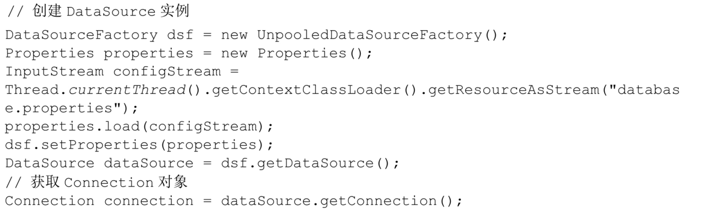

## JDBC API简介

> JDBC是MyBatis的基础，所以自己有必要从JDBC开始来整理一下。

### 什么是JDBC？

> JDBC(java database connectivity)是java语言中提供访问关系型数据库的接口。可以用来执行sql，检索sql和更新数据。
>
> JDBC的API还可以用于分布式、异构的环境中与多个数据源进行交互。

JDBC操作数据源分为大致以下几个步骤

> 1. 建立数据源连接
> 2. 执行sql语句
> 3. 检索sql语句的执行结果
> 4. 关闭连接

**如何建立数据源连接？**

> JDBC API中定义了Connection接口，用于表示与底层数据源的连接。JDBC程序可以使用2种方式来获取到Connection对象。

1）DriverManager

这个是在JDBC 1.0 API中就已经存在，完全有JDBC API实现的驱动管理类。当程序第一次通过URL连接数据源的时候，DriverManager会扫描CLASSPATH下所有的JDBC驱动。

> Connection connection=DriverManager.getConnection("jdbc:hsqldb:men:mybartis","sa","")

2）DataSource

是JDBC 2.0 API中的接口但是JDBC并没有提供实现，DataSource具体的实现由JDBC驱动提供。另外一些数据库连接池(dbcp,c3p0,druid)也提供了对DataSource接口的具体实现。

3）JDBC API中两个DataSource接口比较重要的拓展，用于支撑企业级应用。这个接口为：

- ConnectionPoolDataSource 用于支持缓存和复用Connection对象，这样能够在很大程度上提升应用的性能和伸缩性。
- XADataSource 该实例返回的Connection对象能够支持分布式事物。

**执行SQL语句**

获取到Connection对象之后，我们可以对Connection对象设置事务属性，并且还可以通过Connection接口中提供的方法创建Statement、PreparedStatement或者CallableStatement对象。

Statement就是可以理解为SQL的执行器，我们可以调用Statement接口中定义的executeQuery()方法来执行查询操作，调用executeUpdate来执行更新操作。

**处理SQL的执行结果**

比如执行查询语句然后得到查询的结果，执行更新和插入的语句来得到影响的行数。

JDBC的API还提供了ResultSet接口，该接口实现类封装了SQL的查询结果，我们还可以对ResultSet对象进行遍历。