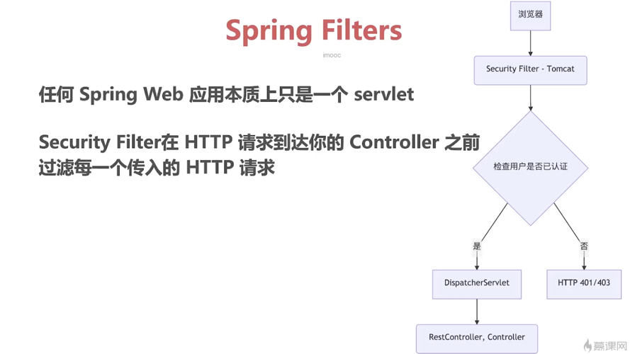
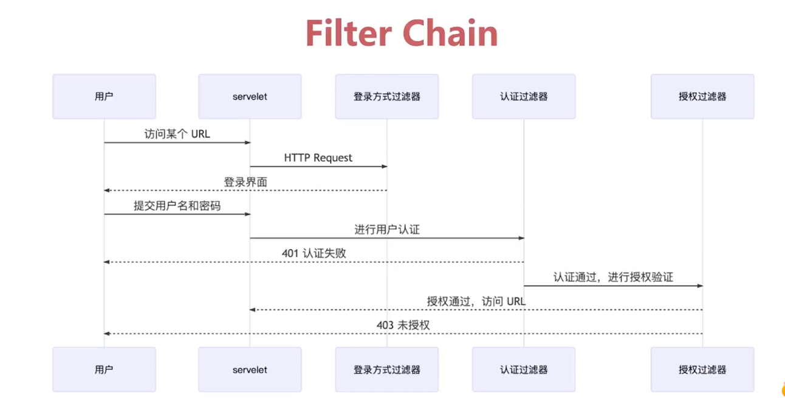
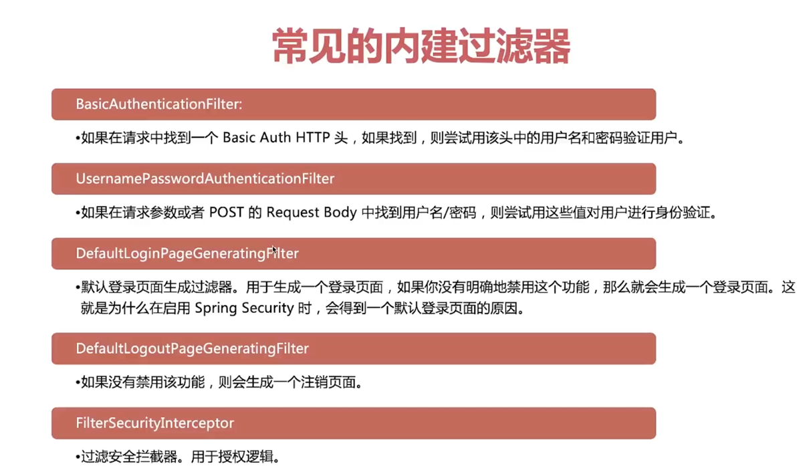

# Spring Security的基本学习

## Spring Security介绍

Spring Security是一个权限的管理框架，可以实现`认证`和`授权`的功能之外还实现了一列其他常见的功能比如使用OAuth2.0来实现第三方登录等。

认证其实就是判断用户是否属于系统中的合法用户，**比如用户使用账号和密码登录，其实就是认证的过程**。

授权就是登录成功之后，查看该用户有哪些权限，然后根据权限来展示或者操作某些指定动作。比如普通用户和超级管理员之间的授权肯定是不一样的。

## Spring Filters

过滤器的基本实现是如何的呢？关键类是`WebSecurityConfigurerAdapter`，这个类是核心类也是来实现自定义认证，鉴权，crsf校验等功能的类。

filter的流程图

过滤器编写逻辑分为4部分

> 1. 从request获取到数据
> 2. 验证登录(认证)
> 3. 对指定的url权限进行验证(授权)
> 4. 放行到controller或者到下个过滤器

**过滤器链**执行流程，因为Spring Security的过滤器链是有很多个的，每个过滤器都有一些特定的职责。

过滤器链的种类

