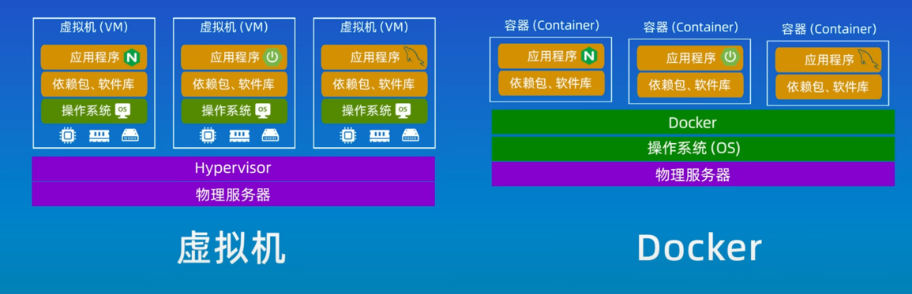
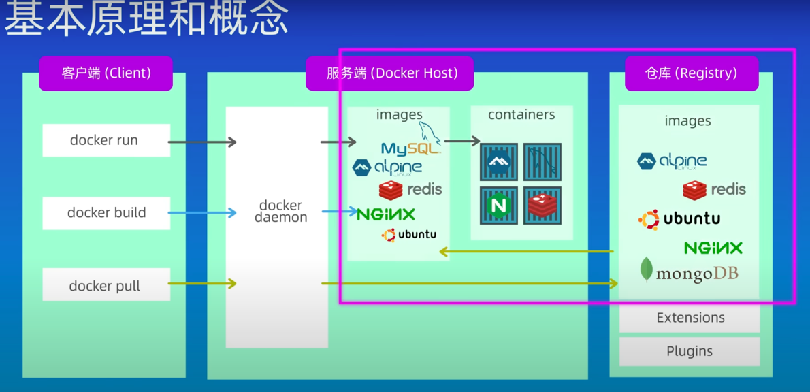

## Docker和虚拟机的区别

## 基本原理和概念

docker三个重要的概念

- 镜像
- 容器
- 仓库

> 镜像只是一个只读的模版；
>
> 容器是给镜像提供了一个运行时的环境，并运行镜像（即运行实例）；
>
> 仓库是用来存储镜像的；

## 容器化和Dockefile

容器化实现的三个步骤

1. 创建一个Dockerfile
2. 使用Dockerfile构建镜像
3. 使用镜像创建和运行容器

## Docker Compose

- 用于定义和运行多容器的应用工具
- 使用yaml文件来配置应用程序的服务
- 一条命令可以创建和启动所有的服务

