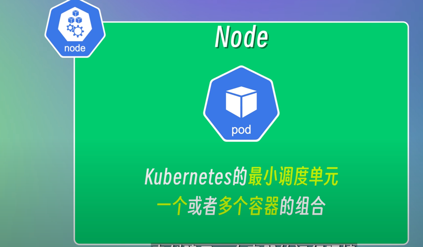
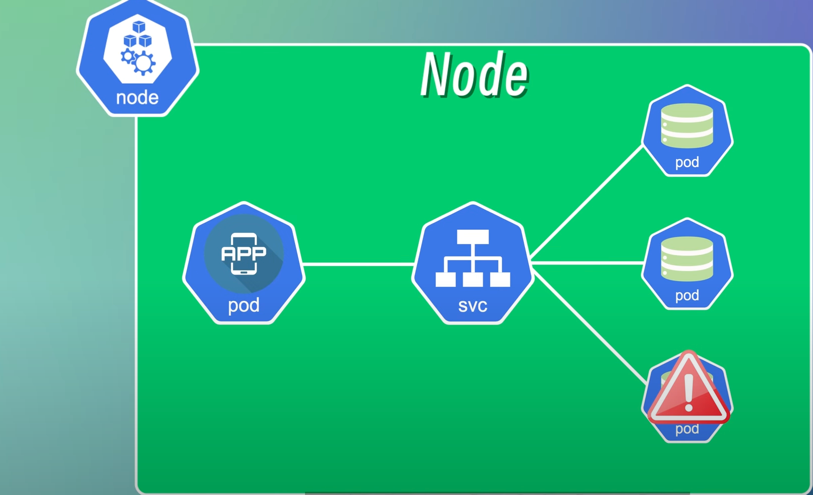
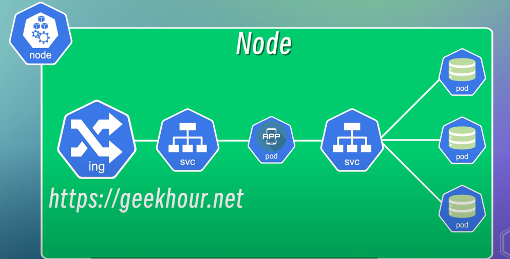
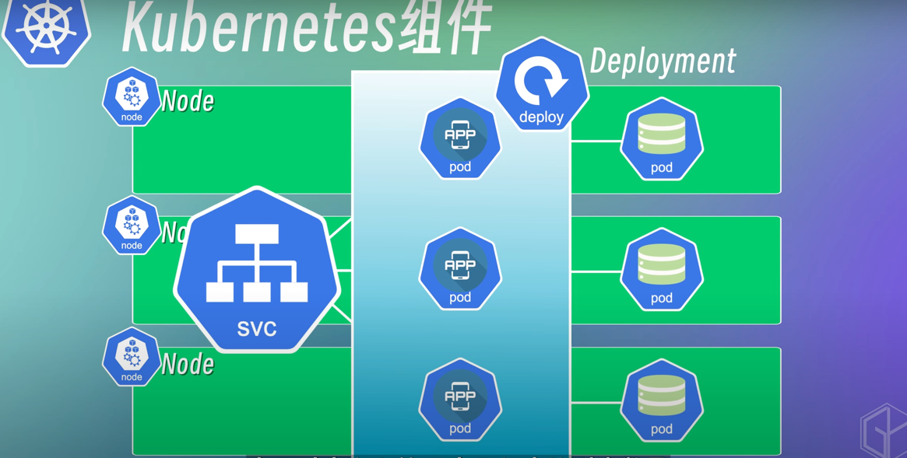
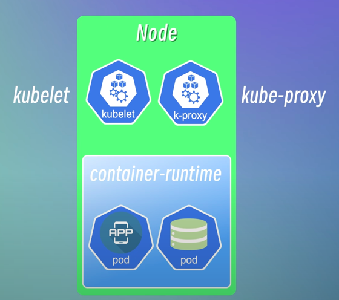
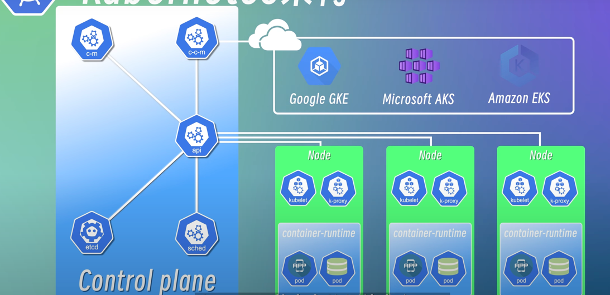

## kubernetes组件

### Node和Pod之间的关系



**一般都建议一个pod中放一个容器，但不是说一个pod只能存放一个容器。**

> 一个pod中放多个容器的时候一般是基于这几个应用是高度耦合的。
>
> 把他们放到同一个pod中更有利于管理的同时也能实现访问速度更快。

pod与pod之间访问是通过ip进行访问的，但是pod是一个极其不稳定的对象，当销毁的时候会重新创建一个全新的pod，而这个时候的ip是变动的。

> 所以这个时候需要有个service的组件,service的ip是不会变化的；
>
> 这个组件可以把一组pod组织起来，然后通过访问服务名来访问这个service背后的pod。



服务类型分为2种

- 内部服务；内部之间提供服务
- 外部服务；可以把aip或者页面暴漏给外部
  - node:port 通过开放一个节点的端口来对外暴露服务。通常是在测试阶段。
  - 而生产中通常是使用域名来进行访问的，这个时候就需要使用ingress组件了。

#### Ingress

Ingress可以配置外部访问内部集群的方式和规则。Ingress也可以配置其他东西，比如负载均衡，SSL证书等等。



### ConfigMap

这里可以配置一些配置信息；配置了应用程序之后，只需要重新加载pod即可。

### Volumes

k8s中的pod重启之后，其中的数据就会消失。这个时候就需要使用volumes组件来让数据挂载到本地目录或者远程存储上。

### Deployment

deployment可以定义和管理应用程序的副本数量和更新策略。这样当某个节点失效的时候，其他节点的应用程序还可以保持可用。



### StatefulSet

用来管理有状态的应用比如mysql数据库。同时也定义了管理应用程序的副本数量。

> 一般都建议把有状态的应用都k8s集群中剥离出来，k8s来部署一些无状态的应用。

## kubernetes架构

k8s的架构分为master节点和worker节点；master节点负责管理work节点，而work节点负责真正部署pod的节点。

worker节点架构



容器运行时(Container Runtimes),这个是负责拉去镜像然后运行镜像。docker中的容器运行时就是：Docker-Engine.常见的容器运行时有：

> 1. Docker-Engine
> 2. Containerd
> 3. CRI-O
> 4. Mirantis Container Runtime

kubelet负责管理这个节点上的pod；

kube-proxy负责网络代理和负载均衡

Master节点架构



master节点上有4个基本组件和一个云端管理组件。

1. api-servier,用来对接一些api，是k8s的网关（权限验证，分发命令）。操作这个api可以使用kubectl客户端，也可以使用其他客户端或者图形化工行
2. etcd;是一个键值存储系统。用来存储所有资源对象的状态信息（其实就是集群的元数据信息）。
3. sched；scheduler调度器，负责监控集群中所有的节点的资源使用情况，然后将pod调度到合适的node上去。
4. c-m；controller-manager；负责管理集群中各种资源对象（pod,node,service）的状态。当集群中有pod失效等不健康状态发生，那么这个组件就会检测到。然后使用对应的策略是恢复pod，比如重新创建一个pod。
5. ccm;cloud conroller manager;它是云平台相关的控制器，负责与云平台的api进行交互。

## minikube环境搭建

> minikube是一个轻量级的kubernetes实现。可以在本地计算机创建虚拟机，并部署仅包含一个节点的简单集群。

安装

```
brew install minikube
-- 启动的时候需要先启动docker
minikube start
```

docker自带的k8s切换

```shell
kubectl config use-context docker-desktop
```

