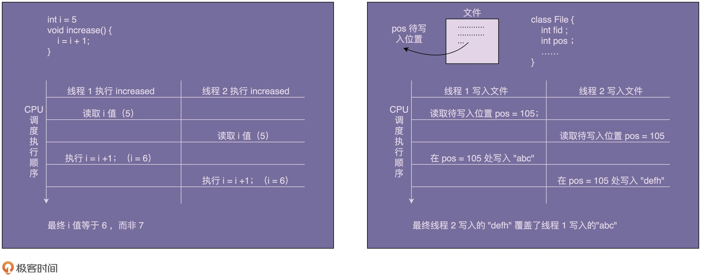

# 设计模式

> SOLID原则，分别代表如下原则：
>
> - 单一功能原则
> - 开闭原则
> - 里氏替换原则
> - 接口隔离原则
> - 依赖反转原则

## 1.设计模式的分类

- 创建型；使用一些方式来创建一些对象，增加了代码的灵活性和可复用性。
- 组合型；使用一些方法来组装对象，从而形成一个比较复杂的对象，并保持结构的灵活和高效。
- 行为模式；负责对象间的高效沟通和指责委派。

## 2.从代码上如何判断哪些是面向对象，哪些是面向过程

面向对象和面向过程都是编程的一个范式而已。

### 2.1滥用get、set方法

```java
public class ShoppingCart {
  private int itemsCount;
  private double totalPrice;
  private List<ShoppingCartItem> items = new ArrayList<>();
  
  public int getItemsCount() {
    return this.itemsCount;
  }
  
  public void setItemsCount(int itemsCount) {
    this.itemsCount = itemsCount;
  }
  
  public double getTotalPrice() {
    return this.totalPrice;
  }
  
  public void setTotalPrice(double totalPrice) {
    this.totalPrice = totalPrice;
  }

  public List<ShoppingCartItem> getItems() {
    return this.items;
  }
  
  public void addItem(ShoppingCartItem item) {
    items.add(item);
    itemsCount++;
    totalPrice += item.getPrice();
  }
  // ...省略其他方法...
}
```

> 既然itemsCount和totalPrice都定义了set方法，那么也意味着，任何人都可以修改这两个值的内容。从而让金额和数量和items的数量对应不上。
>
> items的虽然只提供了一个get方法，但是由于该方法返回的是一个list的对象，我们依然可以对这个集合进行修改，或者内部的对象进行修改。
>
> > **这里的代码违反了面对对象的封装性。**

## 3.抽象类和接口的区别

抽象类更多的是解决代码复用的问题，而接口则更加的偏重于解耦。

从类的关系上来看，抽象类是一种**自下而上**的设计思路，也就是说发现有些代码可以被重新复用的时候，可以使用抽象出来一个抽象类。

而接口则是从上而下的一种情况，这个一般是在编程的时候就开始设计接口，然后再通过对接口的实现来实现具体功能。

## 4.基于贫血模式的MVC架构违背OOP吗？

> 确实是违背了OOP的开发模式。

贫血模式

> 贫血模式就是类中只包含了数据，但是并没有包含逻辑相关的代码。

DDD开发类似于敏捷开发之类的概念，不要把他们想的太高大上。更重要的是，你需要深刻的了解业务，只有你深刻的了解业务之后，你才能使用DDD开发。如果你只是熟悉DDD开发概念，而不熟悉业务场景，那么DDD对你来说并没有太多的作用。

## 5.设计模式

### 5.1单例模式

关于单例模式有如下的几个疑问

> 1. 为什么要使用单例？
> 2. 单例存在哪些问题？
> 3. 单例和静态类之间的区别是什么？
> 4. 有何替代方案？

#### 为什么要使用单例？

这里举一个例子，比如一个日志类，向同一个文件内写入数据。

```java
public class Logger {
  private FileWriter writer;
  
  public Logger() {
    File file = new File("/Users/wangzheng/log.txt");
    writer = new FileWriter(file, true); //true表示追加写入
  }
  
  public void log(String message) {
    writer.write(message);
  }
}

// Logger类的应用示例：
public class UserController {
  private Logger logger = new Logger();
  
  public void login(String username, String password) {
    // ...省略业务逻辑代码...
    logger.log(username + " logined!");
  }
}

public class OrderController {
  private Logger logger = new Logger();
  
  public void create(OrderVo order) {
    // ...省略业务逻辑代码...
    logger.log("Created an order: " + order.toString());
  }
}
```

文件中的内容会被覆盖。

> 1. 创建的时候是创建了两个logger对象，而这两个动作可能是多线程的。
> 2. 在向文件中追加内容的时候，会产生覆盖的效果。



而如果你想加锁，代码如下：

```java
public void log(String message) { 
  synchronized(this) { 
    writer.write(mesasge); 
  } 
}
```

其实作用是不大的，因为这个是对象所，而logger可以创建多个对象。他们是无能无力的。所以必须改为类锁

```java
public class Logger {
  private FileWriter writer;

  public Logger() {
    File file = new File("/Users/wangzheng/log.txt");
    writer = new FileWriter(file, true); //true表示追加写入
  }
  
  public void log(String message) {
    synchronized(Logger.class) { // 类级别的锁
      writer.write(mesasge);
    }
  }
}
```

鉴于FileWriter是一个对象级别的安全实例，其实自己可以创建一个Logger的单例，并且初始化一个FileWriter对象即可。

```java
public class Logger {
  private FileWriter writer;
  private static final Logger instance = new Logger();

  private Logger() {
    File file = new File("/Users/wangzheng/log.txt");
    writer = new FileWriter(file, true); //true表示追加写入
  }
  
  public static Logger getInstance() {
    return instance;
  }
  
  public void log(String message) {
    writer.write(mesasge);
  }
}

// Logger类的应用示例：
public class UserController {
  public void login(String username, String password) {
    // ...省略业务逻辑代码...
    Logger.getInstance().log(username + " logined!");
  }
}

public class OrderController {  
  public void create(OrderVo order) {
    // ...省略业务逻辑代码...
    Logger.getInstance().log("Created a order: " + order.toString());
  }
}
```

还有一些场景需要使用到单例模式，比如计数器，配置信息等。

### 如何创建一个单例？

- 将构造方法private化，这样就避免了通过new来创建对象。
- 考虑对象创建的时候是否有线程安全问题
- 是否支持延迟加载
- 考虑getInstance()时候的性能是否足够高

饿汉式

```java
public class IdGenerator { 
  private AtomicLong id = new AtomicLong(0);
  private static final IdGenerator instance = new IdGenerator();
  private IdGenerator() {}
  public static IdGenerator getInstance() {
    return instance;
  }
  public long getId() { 
    return id.incrementAndGet();
  }
}
```

因为IdGenerator是静态的实例，所以在类加载的时候就已经初始化好了。这个时候不用担心是否会出现多线程安全问题。缺点是不支持懒加载。

> 有人说这样会过度占用资源，并且还会加长初始化的时间。这样的说法我是不认同的，因为如果用到你都会加载到内存中，如果不用到你干嘛写代码中。
>
> 而如果一个类的加载时间比较长，那么还放到懒加载里面就是不合理的，因为这样会降低系统性能，还不如放到初始化的时候来做。
>
> 如果实例占用资源多，按照 fail-fast 的设计原则（有问题及早暴露），那我们也希望在程序启动时就将这个实例初始化好。如果资源不够，就会在程序启动的时候触发报错（比如 Java 中的 PermGen Space OOM），我们可以立即去修复

懒汉式

```java
public class IdGenerator { 
  private AtomicLong id = new AtomicLong(0);
  private static IdGenerator instance;
  private IdGenerator() {}
  public static synchronized IdGenerator getInstance() {
    if (instance == null) {
      instance = new IdGenerator();
    }
    return instance;
  }
  public long getId() { 
    return id.incrementAndGet();
  }
}
```

双重检验

```java
public class IdGenerator { 
  private AtomicLong id = new AtomicLong(0);
  private static IdGenerator instance;
  private IdGenerator() {}
  public static IdGenerator getInstance() {
    if (instance == null) {
      synchronized(IdGenerator.class) { // 此处为类级别的锁
        if (instance == null) {// 这里为何要再加一个Null判断？ 
          //因为可能是多线程导致已经创建好了instance，如果直接创建会有问题。所以必须重写判断下
          //并且由于使用了synchronized，肯定会拿到instance是否真的被创建出来了
          instance = new IdGenerator();
        }
      }
    }
    return instance;
  }
  public long getId() { 
    return id.incrementAndGet();
  }
}
```

```
实际上，上述实现方式存在问题：CPU 指令重排序可能导致在 IdGenerator 类的对象被关键字 new 创建并赋值给 instance 之后，还没来得及初始化（执行构造函数中的代码逻辑），就被另一个线程使用了。这样，另一个线程就使用了一个没有完整初始化的 IdGenerator 类的对象。要解决这个问题，我们只需要给 instance 成员变量添加 volatile 关键字来禁止指令重排序即可。
```

静态内部类

这个方式既可以实现线程安全，又可以实现懒加载

```java
public class IdGenerator { 
  private AtomicLong id = new AtomicLong(0);
  private IdGenerator() {}

  private static class SingletonHolder{
    private static final IdGenerator instance = new IdGenerator();
  }
  
  public static IdGenerator getInstance() {
    return SingletonHolder.instance;
  }
 
  public long getId() { 
    return id.incrementAndGet();
  }
}
```

## 结构型

### 代理模式

> 在不改变原始类的代码基础上，通过引入代理类给原始类添加附加功能。

适用范围都有哪些呢？

> 日志监控，流量监控，用户鉴权，全局异常处理等等。

静态代理的实现思路

> 实现和业务接口一样的实现类，但是内容是添加了前后逻辑的代码。并且嵌入了主体的逻辑代码。

```java
public class UserControllerProxy extends UserController {
  private MetricsCollector metricsCollector;

  public UserControllerProxy() {
    this.metricsCollector = new MetricsCollector();
  }

  public UserVo login(String telephone, String password) {
    long startTimestamp = System.currentTimeMillis();

    UserVo userVo = super.login(telephone, password);

    long endTimeStamp = System.currentTimeMillis();
    long responseTime = endTimeStamp - startTimestamp;
    RequestInfo requestInfo = new RequestInfo("login", responseTime, startTimestamp);
    metricsCollector.recordRequest(requestInfo);

    return userVo;
  }

  public UserVo register(String telephone, String password) {
    long startTimestamp = System.currentTimeMillis();

    UserVo userVo = super.register(telephone, password);

    long endTimeStamp = System.currentTimeMillis();
    long responseTime = endTimeStamp - startTimestamp;
    RequestInfo requestInfo = new RequestInfo("register", responseTime, startTimestamp);
    metricsCollector.recordRequest(requestInfo);

    return userVo;
  }
}
//UserControllerProxy使用举例
UserController userController = new UserControllerProxy();
```

动态代理

> 静态代理缺点就是需要设置N个模版，如果类太多，那么就需要设置很多类似模版的文件。导致大量的代码冗余。很可能这个代理只需要实现很少的代码而已。
>
> 而动态代理又分为两种：
>
> - java自带的动态代理（基于接口的）
> - CGLIB实现的动态代理（无需基于接口）

java自带的动态代理

> 其实实现方式和静态代理大同小异。无非可以总结为这几个顺序和步骤。
>
> 1. 创建需要被代理的类
> 2. 拿到被代理类的classLoader和interfaces
> 3. 创建被代理类
> 4. 调用Proxy.newProxyInstance，然后得到自己被代理的类
> 5. 开始执行想要执行的业务逻辑

业务逻辑类

```java
public interface UserService {
    void update();
}
```

```java
public class UserServiceImpl implements UserService{
    @Override
    public void update() {
        System.out.println("进行update操作....");
    }
}
```

代理类

```java
public class LogHandler implements InvocationHandler {
    Object target;  // 被代理的对象，实际的方法执行者

    public LogHandler(Object target) {
        this.target = target;
    }

    // 调用invoke方法之前执行
    private void before() {
        System.out.println(String.format("log start time [%s] ", new Date()));
    }
    // 调用invoke方法之后执行
    private void after() {
        System.out.println(String.format("log end time [%s] ", new Date()));
    }


    @Override
    public Object invoke(Object proxy, Method method, Object[] args) throws Throwable {
        before();
        Object result = method.invoke(target, args);  // 调用 target 的 method 方法
        after();
        return result;  // 返回方法的执行结果
    }
}
```

调用代理类

```java
public class ProxyClient {
    public static void main(String[] args) {
        // 创建需要被代理的对象
        UserServiceImpl userService=new UserServiceImpl();
        // 得到被代理对象的classloader和接口
        ClassLoader classLoader = userService.getClass().getClassLoader();
        Class<?>[] interfaces = userService.getClass().getInterfaces();
        // 创建动态代理类
        InvocationHandler logHandler=new LogHandler(userService);
        /*
		   5.根据上面提供的信息，创建代理对象 在这个过程中，
               a.JDK会通过根据传入的参数信息动态地在内存中创建和.class 文件等同的字节码
               b.然后根据相应的字节码转换成对应的class，
               c.然后调用newInstance()创建代理实例
		 */
        UserService proxyUserService = (UserService)Proxy.newProxyInstance(classLoader, interfaces, logHandler);

        proxyUserService.update();
    }
}
```

基于CGLIB的动态代理

```java
// 第一个动态代理类
public class LogInterceptor1 implements MethodInterceptor {
    @Override
    public Object intercept(Object object, Method method, Object[] objects, MethodProxy methodProxy) throws Throwable {
        before();
        Object result = methodProxy.invokeSuper(object, objects);
        after();
        return result;
    }
    private void before() {
        System.out.println(String.format("log1 start time [%s] ", new Date()));
    }
    private void after() {
        System.out.println(String.format("log1 end time [%s] ", new Date()));
    }
}
```

```java
// 第二个动态代理类
public class LogInterceptor2 implements MethodInterceptor {
    @Override
    public Object intercept(Object object, Method method, Object[] objects, MethodProxy methodProxy) throws Throwable {
        before();
        Object result = methodProxy.invokeSuper(object, objects);
        after();
        return result;
    }
    private void before() {
        System.out.println(String.format("log2 start time [%s] ", new Date()));
    }
    private void after() {
        System.out.println(String.format("log2 end time [%s] ", new Date()));
    }
}
```

需要被代理的类

```java
public class UserDao {
    public void select() {
        System.out.println("UserDao 查询 selectById");
    }
    public void update() {
        System.out.println("UserDao 更新 update");
    }
}
```

过滤器

```java
// 回调过滤器: 在CGLib回调时可以设置对不同方法执行不同的回调逻辑，或者根本不执行回调。
public class DaoFilter implements CallbackFilter {
    @Override
    public int accept(Method method) {
        if ("select".equals(method.getName())) {
            return 1;   // 代表使用拦截器中的第一个
        }
        return 0;   // 代表使用拦截器列表的第二个
    }
}
```

测试方法

```java
public class CGLIBDemo {
    public static void main(String[] args) {
        LogInterceptor1 logInterceptor1 = new LogInterceptor1();
        LogInterceptor2 daoProxy = new LogInterceptor2();

        Enhancer enhancer = new Enhancer();
        enhancer.setSuperclass(UserDao.class);  // 设置超类，cglib是通过继承来实现的
        enhancer.setCallback(daoProxy);

        enhancer.setCallbacks(new Callback[]{ logInterceptor1,daoProxy, NoOp.INSTANCE});   // 设置多个拦截器，NoOp.INSTANCE是一个空拦截器，不做任何处理
        enhancer.setCallbackFilter(new DaoFilter());


        UserDao dao = (UserDao)enhancer.create();   // 创建代理类
        dao.update();
        dao.select();
    }
}
```

JDK的动态代理和CGLIB的动态代理差异

jdk的动态代理

> 1. 实现InvocationHandler接口，然后重写invoke方法来完成代理的实现。
> 2. jdk的动态代理是使用了反射来实现的
> 3. jdk动态代理之所以**只能代理接口**是因为**代理类本身已经extends了Proxy，而java是不允许多重继承的**，但是允许实现多个接口
> 4. jdk的动态代理跟随着jdk走可以了。维护简单

CGLIB的动态代理

> 由于 JDK 动态代理限制了只能基于接口设计，而对于没有接口的情况，JDK方式解决不了；
>
> CGLib 采用了非常底层的字节码技术，其原理是通过字节码技术为一个类创建子类，并在子类中采用方法拦截的技术拦截所有父类方法的调用，顺势织入横切逻辑，来完成动态代理的实现。
>
> 实现方式实现 MethodInterceptor 接口，重写 intercept 方法，通过 Enhancer 类的回调方法来实现。
>
> 但是CGLib在创建代理对象时所花费的时间却比JDK多得多，所以对于单例的对象，因为无需频繁创建对象，用CGLib合适，反之，使用JDK方式要更为合适一些。
>
> 同时，由于CGLib由于是采用动态创建子类的方法，对于final方法，无法进行代理。
